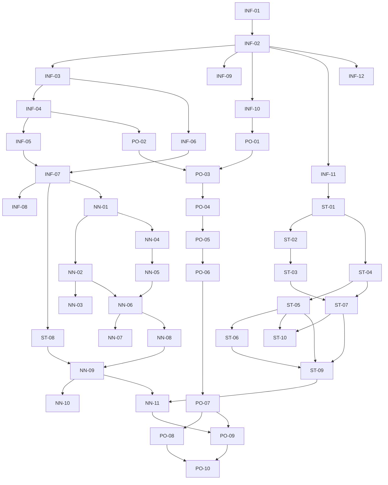

# PROJECT SPECIFICATION — Alpha Research Platform on Qlib

> **Formal project specification for the construction of a Qlib-based quantitative research
> system for temporal-neural Alpha factor mining under strict statistical inference.**

| Field | Value |
|---|---|
| Document ID | `PROJECT_SPEC` |
| Version | `v1.0.0` |
| Status | **NORMATIVE — Ratified baseline** |
| Document class | Highest-order governing specification (supersedes ad-hoc decisions) |
| Project root | `D:\Qlib` |
| Underlying framework | `pyqlib 0.9.7` (Microsoft Qlib) |
| Market data root | `D:\qlib_data\cn_data` (China A-share binary Qlib store) |
| Reference framework source | `D:\qlib_project\qlib` (read-only reference clone) |
| Runtime | `D:\Anaconda3\python.exe` — CPython 3.12.7 |
| Date of ratification | 2026-09-15 |
| Owner | Quantitative Research Architecture (Lead Architect) |

### Normative language

The key words **MUST**, **MUST NOT**, **REQUIRED**, **SHALL**, **SHOULD**, **SHOULD NOT**,
**MAY**, and **OPTIONAL** in this document are to be interpreted as described in RFC 2119.

Any deviation from a **MUST** clause invalidates the affected research result. Any deviation
from a **SHOULD** clause MUST be recorded as an Architecture Decision Record (ADR) in
`docs/adr/` together with its justification.

### Table of contents

1. [Project Overview and Research Motivation](#1-project-overview-and-research-motivation)
2. [Mathematical and Statistical Formalization](#2-mathematical-and-statistical-formalization)
3. [System Architecture and Module Design](#3-system-architecture-and-module-design)
4. [Development Task Breakdown](#4-development-task-breakdown)
5. [Cross-Cutting Engineering Standards](#5-cross-cutting-engineering-standards)
6. [Execution Discipline](#6-execution-discipline)

---

## 1. Project Overview and Research Motivation

### 1.1 Project objective

This project constructs a **research-grade Alpha discovery system** whose signal-generation
layer is composed of **temporal neural networks** (sequence encoders operating on rolling
windows of cross-sectional features) and whose **validation layer is governed by formal
statistical inference** rather than by point estimates of performance.

Formally, the system MUST answer the following question with a defensible degree of
statistical confidence:

> Given the information set $\mathcal{F}_t$ observable at the close of trading day $t$, does
> the neural mapping $f_\theta : \mathbb{R}^{L \times d} \to \mathbb{R}$ produce a
> cross-sectional ordering of assets whose **risk-adjusted, transaction-cost-net** expected
> return is **positive and statistically distinguishable from zero** out of sample?

The three pillars of the system are therefore:

| Pillar | Responsibility | Module layer |
|---|---|---|
| **Inference** | Rank IC, HAC $t$-statistics, bootstrap monotonicity tests, multiple-testing control | `qresearch.stats` |
| **Prediction** | Student-$t$ heteroskedastic temporal neural networks | `qresearch.models` |
| **Allocation** | Cost-aware mean–variance programming, capacity analysis | `qresearch.portfolio` |

### 1.2 Core pain points to be resolved

Traditional quantitative research pipelines fail in three well-documented modes. This project
treats each failure mode as an explicit engineering defect with a corresponding design
countermeasure and an automated regression test.

#### 1.2.1 Pain point A — Look-ahead bias

**Definition.** A pipeline exhibits look-ahead bias iff any input to the decision at time $t$
is not $\mathcal{F}_t$-measurable, i.e. iff there exists a feature component $x^{(j)}_{i,t}$
with $\sigma\left(x^{(j)}_{i,t}\right) \not\subseteq \mathcal{F}_t$.

Sources of leakage in practice: centering or normalizing a feature with full-sample
statistics; using the day-$t$ `close` while assuming execution at the day-$t$ `open`;
imputing missing values with future-aware semantics; tuning hyper-parameters on the `test`
segment; rebalancing on a calendar that includes suspended or limit-locked names.

**Countermeasures (MUST):**
- Every processor whose parameters are estimated (normalization, imputation, winsorization
  thresholds) MUST be fitted on the `train` segment only and applied to `valid`/`test`
  through `DataHandlerLP` fit/transform separation (`fit_start_time`, `fit_end_time`).
- Execution semantics MUST be pre-declared: signal computed at $t$, execution at the
  **open** of $t+1$, label measured over $[t+1,\; t+1+h]$.
- An automated leakage audit (`tests/test_leakage.py`) MUST assert that no feature at $t$
  depends on data beyond $t$, by replaying a calendar prefix and comparing values.

#### 1.2.2 Pain point B — Over-fitting

**Definition.** With $K$ candidate configurations selected on the same sample of $T$
cross-sectional periods, the in-sample maximum of the performance statistic is biased upward.
Under an i.i.d. Gaussian null for the IC series,
$$\mathbb{E}\left[\max_{k \le K} \widehat{IC}_k\right] \approx \sigma_{IC}\sqrt{2\ln K} > 0,$$
so a "discovered" IC of the order $\sigma_{IC}\sqrt{2\ln K}$ carries no evidence whatsoever.

**Countermeasures (MUST):**
- Hyper-parameter search MUST use purged and embargoed cross-validation (Section 2.2.5),
  never a single chronological hold-out reused for selection.
- Every reported IC MUST be accompanied by a HAC (Newey–West) $t$-statistic and a bootstrap
  confidence interval.
- Multiple-testing control (Benjamini–Hochberg FDR at $q_{BH} = 0.10$) MUST be applied to
  every family of factor and hyper-parameter comparisons.
- A **deflated Sharpe ratio** (Section 2.2.7) MUST be reported for the final strategy and
  MUST be non-negative at the 5% level.
- Signal ensembles MUST be seed-averaged; single-seed results MUST NOT be promoted to the
  final portfolio.

#### 1.2.3 Pain point C — Transaction cost negligence

**Definition.** A strategy optimized on gross signal quality implicitly assumes
$\mathcal{C}_t \equiv 0$. With per-period turnover $\tau$, proportional round-trip cost rate
$c$ and annualized volatility $\sigma_{ann}$, the net information ratio satisfies the
approximate bound
$$IR_{net} \;\lesssim\; IR_{gross} \;-\; \frac{c\,\tau\,\sqrt{252}}{\sigma_{ann}},$$
which for daily rebalancing with $\tau = 0.8$, $c = 0.002$ and $\sigma_{ann} = 0.20$
discards approximately $2.0$ units of IR.

**Countermeasures (MUST):**
- Cost parameters MUST mirror the Qlib `Exchange` semantics (`open_cost = 0.0015`,
  `close_cost = 0.0025`, `min_cost = 5.0`, `trade_unit = 100`, `limit_threshold`,
  `deal_price`), MUST be configurable, and MUST NOT be silently zeroed in any reported
  result.
- Turnover MUST be an economically active term inside the optimizer (Section 2.4), not a
  post-hoc diagnostic.
- Every headline metric MUST be reported as a **gross vs. net** pair; the net figures are
  the binding acceptance criteria.

### 1.3 Scope

**In scope.** Point-in-time data handling; expression-based and neural feature construction;
Student-$t$ temporal neural prediction with uncertainty; formal statistical inference on
signals; cost-aware mean–variance portfolio construction; event-driven backtesting on the
Qlib executor; experiment tracking and reproducible reporting.

**Out of scope (non-goals).** Live order routing and broker connectivity; intraday
(sub-daily) Alpha; alternative-data acquisition (satellite, NLP news feeds); high-frequency
microstructure modelling; reinforcement-learning (RL) allocation policies; production
deployment and low-latency serving.

### 1.4 Acceptance criteria

The project is deemed successful iff **all** of the following hold on the `test` segment
under the frozen configuration recorded in the experiment tracker. Net (after-cost) figures
are binding.

| ID | Criterion | Threshold | Verifying module |
|---|---|---|---|
| AC-1 | Mean daily Rank IC | $\ge 0.025$ | `qresearch.stats` |
| AC-2 | Newey–West $t$-statistic of mean IC | $\ge 2.5$ | `qresearch.stats` |
| AC-3 | Annualized IC information ratio | $\ge 0.35$ | `qresearch.stats` |
| AC-4 | Quantile monotonicity bootstrap $p$-value | $\le 0.05$ | `qresearch.stats` |
| AC-5 | Net long–short spread NW $t$-statistic | $\ge 2.0$ | `qresearch.portfolio` |
| AC-6 | Deflated Sharpe ratio (net) | significantly $> 0$ at 5% | `qresearch.stats` |
| AC-7 | Annualized turnover | $\le 12\times$ | `qresearch.portfolio` |
| AC-8 | Leakage audit suite | 100% pass | `tests/test_leakage.py` |

**Reporting rule.** No result may be cited internally or externally unless it carries the
full tuple $(\widehat{IC},\; t_{NW},\; p_{NW},\; \text{bootstrap CI},\; \text{turnover},\;
\text{net IR})$. Partial reporting is a specification violation.

---

## 2. Mathematical and Statistical Formalization

### 2.1 State space, symbols and filtration

Let the trading calendar be $\mathcal{T} = \{t_1 < t_2 < \dots < t_T\}$, ordered
increasingly, with $|\mathcal{T}| = T$. Identifiers are defined as follows:

| Symbol | Domain | Type | Meaning |
|---|---|---|---|
| $t$ | $\mathcal{T}$ | date index (`pd.Timestamp`) | Decision date (close of day $t$) |
| $i$ | $\mathcal{U}_t$ | instrument id (`str`, e.g. `SH600000`) | Asset identifier |
| $\mathcal{U}_t \subseteq \mathcal{U}$ | power set of universe | set | Tradable universe at $t$ |
| $n_t = \|\mathcal{U}_t\|$ | $\mathbb{N}$ | int | Cross-sectional size |
| $L$ | $\mathbb{N}$ | int | Look-back window length (trading days) |
| $d$ | $\mathbb{N}$ | int | Number of feature channels |
| $\mathbf{x}_{i,t}$ | $\mathbb{R}^{L \times d}$ | `np.float32` | Feature window ending at $t$ |
| $x^{(j)}_{i,t}$ | $\mathbb{R}$ | `np.float32` | Scalar of feature channel $j$ at $t$ |
| $y_{i,t+1}$ | $\mathbb{R}$ | `np.float32` | Forward return target |
| $m_{i,t}$ | $\{0,1\}$ | `bool` | Availability / loss mask |
| $w_{i,t}$ | $\mathbb{R}_{\ge 0}$ | `np.float32` | Sample weight |
| $\theta \in \Theta$ | parameter space | tensor | Neural network parameters |
| $z_{i,t}$ | $\mathbb{R}$ | `np.float64` | Raw Alpha score (pre-ranking) |
| $\hat{y}_{i,t}$ | $\mathbb{R}$ | `np.float64` | Model prediction (location) |
| $\mathcal{F}_t$ | $\sigma$-algebra | filtration | Information set observable at close of $t$ |

**Assumption A1 (Adaptedness / strict causality).** For all $i$ and $t$,
$\mathbf{x}_{i,t}$ and $z_{i,t}$ are $\mathcal{F}_t$-measurable, and
$\mathcal{F}_{t_1} \subseteq \mathcal{F}_{t_2}$ for $t_1 < t_2$.

**Assumption A2 (No survivorship bias).** $\mathcal{U}_t$ MUST be reconstructed
point-in-time, including names later delisted; the constituent snapshot MUST be stored as an
immutable artifact per rebalance date.

**Assumption A3 (Weak stationarity of the IC series).** The sequence
$\{\rho_t\}_{t \in \mathcal{T}}$ is assumed weakly stationary and short-range dependent, so
that a HAC variance estimator is consistent (this assumption is testable via Section 2.2.3).

### 2.1.1 Target variable

The canonical target is the $h$-day forward return based on execution prices, defined as
$$y_{i,t+1} \;=\; \frac{P^{\,open}_{i,\,t+1+h}}{P^{\,open}_{i,\,t+1}} - 1 ,$$
with $h \in \{1, 5, 20\}$ configurable per study. Two ancillary targets MUST also be
supported:

- **Cross-sectional rank target**: $\tilde{y}_{i,t+1} = \dfrac{\mathrm{Rank}_t\!\left(y_{i,t+1}\right)}{n_t + 1}$, taking values in $(0,1)$.
- **Cross-sectional $z$ target**: $\ddot{y}_{i,t+1} = \dfrac{y_{i,t+1} - \mu_t}{\sigma_t}$, where $\mu_t$ and $\sigma_t$ are the cross-sectional mean and (robust) standard deviation at $t$.

**Label embargo rule.** Because $y_{i,t+1}$ spans $\left[t+1, t+1+h\right]$, any sample at
$t'$ with $t' + h \ge t + 1$ shares information with the sample at $t$; consequently all
resampling schemes MUST purge the window $\left[t - h + 1,\; t + h - 1\right]$ around each
evaluation point (Section 2.2.5).

### 2.2 Statistical inference framework

#### 2.2.1 Rank information coefficient

The **primary** performance statistic is the per-period cross-sectional Spearman rank
correlation between forecasts and realized targets:

$$
\rho_t \;=\; \mathrm{Corr}_S\!\left(\left\{\hat{y}_{i,t}\right\}_{i \in \mathcal{U}_t},\;
\left\{y_{i,t+1}\right\}_{i \in \mathcal{U}_t}\right)
\;=\; 1 - \frac{6\sum_{i \in \mathcal{U}_t} d_{i,t}^{\,2}}{n_t\left(n_t^2 - 1\right)},
\qquad
d_{i,t} = \mathrm{Rank}_t\!\left(\hat{y}_{i,t}\right) - \mathrm{Rank}_t\!\left(y_{i,t+1}\right),
$$

computed only over the admissible set
$\mathcal{A}_t = \left\{ i \in \mathcal{U}_t : m_{i,t} = 1 \right\}$ with $n_t = |\mathcal{A}_t|$,
and subject to the minimum cross-sectional support rule $n_t \ge n_{\min}$ (default
$n_{\min} = 30$; periods violating it MUST be dropped and counted).

The **Pearson information coefficient** $\rho^{P}_t$ is computed on the same admissible set
and MUST be reported alongside, because it isolates the magnitude (rather than the ordering)
of the signal.

From the IC series $\left\{\rho_t\right\}_{t=1}^{T}$ we define the estimands:

$$
\bar{\rho} \;=\; \frac{1}{T}\sum_{t=1}^{T}\rho_t,
\qquad
\widehat{\sigma}^{\,2}_{\rho} \;=\; \frac{1}{T-1}\sum_{t=1}^{T}\left(\rho_t - \bar{\rho}\right)^2 ,
\qquad
\widehat{ICIR} \;=\; \frac{\bar{\rho}}{\widehat{\sigma}_{\rho}},
\qquad
\widehat{ICIR}_{ann} \;=\; \sqrt{\Delta}\;\widehat{ICIR},
$$

where $\Delta$ denotes the number of decision periods per annum, estimated as
$\Delta = 252 / \bar{g}$ with $\bar{g}$ the mean trading-day gap separating consecutive
rebalance dates ($\Delta = 252$ for daily rebalancing and $\Delta = 252/5$ for weekly).
The long–short spread statistics derived in Section 2.2.4 serve as the economic
counterpart to this purely statistical measure.

**Decision rule.** The null hypothesis under test is
$$H_0:\; \mathbb{E}\left[\rho_t\right] = 0 \qquad \text{against} \qquad
H_1:\; \mathbb{E}\left[\rho_t\right] \neq 0 .$$

#### 2.2.2 Newey–West (HAC) $t$-statistic

The IC series is serially correlated by construction (overlapping labels, persistent factor
exposure, slow-moving style returns). The i.i.d. standard error is therefore downward biased
and MUST NOT be used. Define the centred series $u_t = \rho_t - \bar{\rho}$ and the sample
autocovariances

$$
\hat{\gamma}_0 = \frac{1}{T}\sum_{t=1}^{T} u_t^2,
\qquad
\hat{\gamma}_{\ell} = \frac{1}{T}\sum_{t=\ell+1}^{T} u_t\, u_{t-\ell},
\qquad \ell = 1, \dots, L_{NW}.
$$

The Newey–West (1987) Bartlett-kernel HAC long-run variance estimator and its bandwidth are

$$
\widehat{\sigma}^{\,2}_{NW} \;=\; \hat{\gamma}_0 \;+\; 2\sum_{\ell=1}^{L_{NW}}
\left(1 - \frac{\ell}{L_{NW}+1}\right)\hat{\gamma}_{\ell},
\qquad
L_{NW} \;=\; \left\lfloor 4\left(\frac{T}{100}\right)^{2/9}\right\rfloor
\;\;\text{(Newey–West 1994 automatic rule)} ,
$$

and the test statistic and two-sided $p$-value are

$$
t_{NW} \;=\; \frac{\bar{\rho}}{\sqrt{\widehat{\sigma}^{\,2}_{NW} / T}}
\;\;\xrightarrow[\;T \to \infty\;]{d}\; \mathcal{N}\!\left(0, 1\right),
\qquad
p_{NW} \;=\; 2\left(1 - \Phi\!\left(\left| t_{NW} \right|\right)\right).
$$

**Small-sample options (MUST be configurable, and MUST be reported):**

1. Student-$t$ reference distribution in place of the normal, with $\nu_{df} = T - 1$ degrees
   of freedom, which corrects part of the finite-sample under-coverage.
2. A finite-sample correction factor $\sqrt{T/(T - k_{reg})}$ where $k_{reg}$ is the number of
   estimated parameters (including the bandwidth).
3. Optional pre-whitening with an AR(1) fit followed by automatic bandwidth re-estimation
   (Andrews–Monahan 1992), which reduces the well-known downward bias of the Bartlett
   estimator.

A **pointwise** IC $t$-statistic is insufficient: statistical significance MUST additionally
be assessed by the block bootstrap of Section 2.2.3, because the IC series is left-skewed,
excessively kurtotic and exhibits volatility clustering, all of which degrade normal
approximations.

#### 2.2.3 Resampling engine (stationary and block bootstrap)

All resampling MUST preserve the serial dependence structure of the daily statistics.
The default engine is the **stationary bootstrap** of Politis and Romano (1994), with
**circular block bootstrap** and **i.i.d. bootstrap** available as registered alternatives
(`bootstrap_method ∈ {stationary, circular_block, iid}`) and used exclusively for
control experiments.

For a statistic functional $g : \mathbb{R}^{T} \to \mathbb{R}$ evaluated on
$\left\{x_t\right\}_{t=1}^{T}$ (e.g. $\bar{\rho}$ or $\min_q \Delta_q$), the stationary
bootstrap generates indices $t^{*}_1, \dots, t^{*}_T$ by a two-state Markov chain that
restarts a new block with probability $p^{*} = 1/\bar{b}$ and continues the current block
with probability $1 - p^{*}$, where $\bar{b}$ is the **expected block length**. The bootstrap
distribution is $\widehat{G}^{*}_B(u) = \frac{1}{B}\sum_{b=1}^{B}\mathbb{1}\left[g\left(x^{*,(b)}\right) \le u\right]$
with $B = 10{,}000$ replicates by default.

**Bandwidth selection.** $\bar{b}$ MUST be selected by the automatic rule of Politis and
White (2004) as implemented in `qresearch.stats.bootstrap.select_block_length`, computed
from the autocorrelation structure of the statistic series; a fixed default of
$\bar{b} = \lceil 1.5\,h \rceil$ (label horizon $h$) applies only when the automatic rule is
disabled, and this choice MUST be logged.

**Determinism.** The bootstrap MUST be fully reproducible: a single integer seed is derived
from the experiment `recorder_id`, and each replicate draws from
`np.random.default_rng(np.random.SeedSequence(entropy=seed, spawn_key=(b,)))` so that
results are invariant to parallelism.

#### 2.2.4 Quantile portfolios and the monotonicity bootstrap test

**Construction.** At each $t$, sort the admissible set by predicted score and partition it
into $Q$ equal-count buckets (default $Q = 10$). With
$\mathrm{Rank}_t(\hat{y}_{i,t}) \in \{1,\dots,n_t\}$,

$$
q_{i,t} \;=\; \left\lceil \frac{Q \cdot \mathrm{Rank}_t\!\left(\hat{y}_{i,t}\right)}{n_t} \right\rceil
\in \{1,\dots,Q\},
\qquad
\mathcal{B}_{q,t} = \left\{ i \in \mathcal{A}_t : q_{i,t} = q \right\}.
$$

Equal-weighted and value-weighted bucket returns are both REQUIRED:

$$
r^{(q)}_{t} \;=\; \frac{1}{n_{q,t}}\sum_{i \in \mathcal{B}_{q,t}} y_{i,t+1},
\qquad
r^{(q),VW}_{t} \;=\; \frac{\sum_{i \in \mathcal{B}_{q,t}} \upsilon_{i,t-1}\, y_{i,t+1}}{\sum_{i \in \mathcal{B}_{q,t}} \upsilon_{i,t-1}},
$$

where $\upsilon_{i,t-1}$ is the free-float market capitalization available at $t-1$.
Aggregate means are $\bar{r}^{(q)} = \frac{1}{T}\sum_{t=1}^{T} r^{(q)}_{t}$.

**Monotonicity hypotheses.** Define the **critical adjacent gap**

$$
\Delta \;=\; \min_{q \in \{1,\dots,Q-1\}} \left( \mu^{(q+1)} - \mu^{(q)} \right),
\qquad \mu^{(q)} = \mathbb{E}\left[ r^{(q)}_{t} \right],
$$

with the one-sided decision problem
$$H_0:\; \Delta \le 0 \qquad \text{versus} \qquad H_1:\; \Delta > 0 .$$
Under $H_1$ the *weakest* adjacent step is still positive, which is a strictly stronger
statement than monotonicity of the extremes and is the economically meaningful requirement
for a tradable ranking.

**Bootstrap algorithm (MUST follow this sequence).**

1. Estimate $\bar{b}$ per Section 2.2.3 and draw $B$ index sets
   $\mathcal{I}^{*,(b)} = \left\{ t^{*,(b)}_1, \dots, t^{*,(b)}_T \right\}$.
2. For each replicate compute the bootstrap bucket means
   $\bar{r}^{*,(q),(b)} = \frac{1}{T}\sum_{s=1}^{T} r^{(q)}_{t^{*,(b)}_s}$ and the
   **null-imposed (recentred) critical gap**
   $$\Delta^{*,(b)} \;=\; \min_{q \in \{1,\dots,Q-1\}} \left\{
   \left( \bar{r}^{*,(q+1),(b)} - \bar{r}^{(q+1)} \right)
   - \left( \bar{r}^{*,(q),(b)} - \bar{r}^{(q)} \right) \right\},$$
   which forces the bootstrap distribution to have zero expected adjacent gaps, i.e. it
   simulates the least-favourable boundary of $H_0$. The test decision is then
   $$\hat{p}_{mono} \;=\; \frac{1}{B}\sum_{b=1}^{B} \mathbb{1}\!\left[ \Delta^{*,(b)} \ge \widehat{\Delta} \right],$$
   where $\widehat{\Delta} = \min_q \left( \bar{r}^{(q+1)} - \bar{r}^{(q)} \right)$ is the
   observed statistic. $\hat{p}_{mono}$ is a conservative one-sided $p$-value and MUST NOT be
   compared against $\alpha$ using a normal approximation.
3. Additionally compute the **studentized** version $\Delta^{*,(b)} / \widehat{SE}^{*,(b)}$ with
   $\widehat{SE}^{*,(b)}$ the within-replicate Newey–West standard error, to achieve
   asymptotic refinement in the presence of heteroskedasticity.
4. Report the $(1-\alpha)$ percentile interval for each $\bar{r}^{(q)}$ and for the
   long–short spread. The **primary economic test** is the spread
   $r^{LS}_t = r^{(Q)}_t - r^{(1)}_t$, whose mean is tested with both the NW $t$-statistic
   (Section 2.2.2) and this block bootstrap.
5. Report the cross-quantile Spearman correlation
   $\hat{\rho}_{mono} = \mathrm{Corr}_S\left(1{:}Q,\; \bar{r}^{(1)},\dots,\bar{r}^{(Q)}\right)$
   together with its own bootstrap interval; a value below $0.8$ MUST raise a warning in the
   generated report.

#### 2.2.5 Purged and embargoed cross-validation

Standard $K$-fold cross-validation is invalid for financial panels because (i) labels
overlap in time and (ii) features are serially correlated. The project REQUIRES the
following splitter (`qresearch.stats.splits.PurgedKFold` and
`qresearch.stats.splits.CombinatorialPurgedKFold`):

For a fold whose test index set is $\mathcal{J} \subseteq \{1,\dots,T\}$, the training set is

$$
\mathcal{I} \;=\; \left\{ t : t \notin \mathcal{P} \cup \mathcal{E} \right\},
\qquad
\mathcal{P} = \bigcup_{j \in \mathcal{J}} \left[ j - h + 1,\; j + h - 1 \right],
\qquad
\mathcal{E} = \bigcup_{j \in \mathcal{J}} \left[ \max(\mathcal{J}) + 1,\; \max(\mathcal{J}) + e \right],
$$

where $\mathcal{P}$ is the **purge** window induced by the label horizon $h$ and
$\mathcal{E}$ is the **embargo** of length $e$ (default $e = \lceil 0.01\,T \rceil$ trading
days, measured after the test block, which removes the residual serial-correlation leakage
of feature windows of length $L$).

Rules:
- Hyper-parameter selection MUST use only `train`-derived folds; the `test` segment is
  touched exactly once per frozen configuration.
- Purged CV MUST be applied at the **group (date) level**, never at the row level: all
  instruments sharing a date belong to the same fold.
- The number of folds is fixed at $K=5$ with an embargo of $e$; the resulting
  out-of-fold IC must exhibit dispersion across folds, and the fold-level IC series MUST be
  reported (mean, min, max, standard deviation).

#### 2.2.6 Predictive accuracy comparison and over-fitting diagnostics

**Diebold–Mariano test.** To decide whether two signal generators
$\hat{y}^{(A)}, \hat{y}^{(B)}$ differ in accuracy, define the loss differential
$$d_t = \left( \rho^{(A)}_t \right)^{2} - \left( \rho^{(B)}_t \right)^{2}
\quad \text{or} \quad d_t = \left| \rho^{(A)}_t \right| - \left| \rho^{(B)}_t \right| ,$$
and test $H_0: \mathbb{E}[d_t] = 0$ with
$$DM = \frac{\bar{d}}{\sqrt{\widehat{\sigma}^{\,2}_{NW}(d) / T}} \xrightarrow{d} \mathcal{N}(0,1),$$
using the HAC estimator of Section 2.2.2 with bandwidth
$L_{NW} = \lfloor 4 (T/100)^{2/9} \rfloor$ (extended to $\lfloor 1.5\,h \rfloor$ if larger).

**Probability of backtest over-fitting (PBO).** For the model-selection family, the
combinatorially symmetric cross-validation (CSCV) procedure of Bailey, Borwein, López de
Prado and Zhu (2017) SHOULD be computed: partition the $T$ periods into $S$ groups
(default $S = 16$), enumerate the $\binom{S}{S/2}$ symmetric splits, select the
in-sample-best configuration and record its out-of-sample rank; PBO is the frequency with
which the in-sample winner falls below the out-of-sample median. A PBO exceeding $0.5$
indicates the search procedure is anti-predictive and the study MUST be restarted with a
smaller configuration family.

#### 2.2.7 Multiple-testing control and deflated Sharpe ratio

When $M$ hypotheses are tested simultaneously (factor family or hyper-parameter family) with
$p$-values $p_{(1)} \le \dots \le p_{(M)}$, the Benjamini–Hochberg procedure at level
$q_{BH}$ rejects $H_{(1)}, \dots, H_{(k^{*})}$ where
$$k^{*} = \max\left\{ k : p_{(k)} \le \frac{k}{M}\,q_{BH} \right\}.$$
The Holm step-down procedure MUST additionally be available for family-wise error control
when $M \le 10$.

Finally, selection across $K$ trials inflates the Sharpe ratio. The **deflated Sharpe ratio**
is defined as
$$DSR \;=\; \Phi\!\left(
\frac{\left(\widehat{SR} - SR^{*}\right)\sqrt{T_{obs} - 1}}
{\sqrt{1 - \hat{\gamma}_3 \widehat{SR} + \frac{\hat{\gamma}_4 - 1}{4}\widehat{SR}^{2}}}
\right),$$
where $\widehat{SR}$ is the non-annualized Sharpe ratio of the strategy's net excess
returns, $\hat{\gamma}_3, \hat{\gamma}_4$ are their skewness and kurtosis, $T_{obs}$ the
number of observations, and $SR^{*}$ is the expected maximum Sharpe ratio under the null of
$K$ independent trials with cross-trial Sharpe standard deviation $\widehat{V}$:
$$SR^{*} \;=\; \widehat{V}\left[(1 - \gamma)\,\Phi^{-1}\!\left(1 - \frac{1}{K}\right)
+ \gamma\,\Phi^{-1}\!\left(1 - \frac{1}{K e}\right)\right], \qquad \gamma \approx 0.5772
\;\text{(Euler–Mascheroni constant)} .$$
$K$ MUST be the *effective* number of independent trials, estimated from the correlation
matrix of trial returns as $K_{eff} = M - \sum \text{(redundant trials)}$; the estimation
method MUST be recorded. The corresponding $p$-value is $p_{DSR} = 1 - DSR$.

### 2.3 Neural network mapping and loss functions

#### 2.3.1 The mapping $f_\theta$

The predictor is a composite map

$$
f_\theta \;:\; \mathbb{R}^{L \times d} \times \mathbb{R}^{d_{aux}} \to \mathbb{R}^{2} \times \mathbb{R}_{>0},
\qquad
f_\theta\!\left(\mathbf{x}_{i,t}, \mathbf{c}_{i,t}\right)
= \left(\mu_{i,t},\; \log \sigma_{i,t},\; \nu_{i,t}\right),
$$

where $\mathbf{x}_{i,t} \in \mathbb{R}^{L \times d}$ is the look-back window,
$\mathbf{c}_{i,t} \in \mathbb{R}^{d_{aux}}$ carries static covariates (industry one-hot,
size decile, liquidity bucket) and $\nu_{i,t}$ is the degrees-of-freedom parameter.
The composite decomposes as $f_\theta = h_{\theta_h} \circ e_{\theta_e}$ with:

$$
\mathbf{h}_{i,t} \;=\; e_{\theta_e}\!\left(\mathbf{x}_{i,t}, \mathbf{c}_{i,t}\right) \in \mathbb{R}^{d_h},
\qquad
\left(\mu, \log\sigma, \log\nu\right)_{i,t} \;=\; h_{\theta_h}\!\left(\mathbf{h}_{i,t}\right),
$$

where the encoder $e_{\theta_e}$ is a recurrent, convolutional or attention-based sequence
model. For the reference recurrent implementation with gated recurrent units, the recursions
at step $\tau \in \{1, \dots, L\}$ are

$$
\mathbf{r}_\tau = \varsigma\!\left(W_r \tilde{\mathbf{x}}_\tau + U_r \mathbf{h}_{\tau-1} + b_r\right),
\qquad
\mathbf{u}_\tau = \varsigma\!\left(W_u \tilde{\mathbf{x}}_\tau + U_u \mathbf{h}_{\tau-1} + b_u\right),
$$

$$
\tilde{\mathbf{h}}_\tau = \tanh\!\left(W_h \tilde{\mathbf{x}}_\tau + U_h \left(\mathbf{r}_\tau \odot \mathbf{h}_{\tau-1}\right) + b_h\right),
\qquad
\mathbf{h}_\tau = \left(1 - \mathbf{u}_\tau\right) \odot \mathbf{h}_{\tau-1} + \mathbf{u}_\tau \odot \tilde{\mathbf{h}}_\tau ,
$$

with $\varsigma(\cdot)$ the logistic sigmoid and $\tilde{\mathbf{x}}_\tau$ the
(optionally layer-normalized) input at step $\tau$. The final hidden state is pooled through
a linear head:
$\left(\mu, \log\sigma, \log\nu\right) = \mathbf{w}_o^{\top}\mathbf{h}_L + b_o$.

**Parameterization constraints (MUST).** $\log\sigma$ is emitted unconstrained and exponentiated
as $\sigma = \exp(\log\sigma) + \sigma_{\min}$ with $\sigma_{\min} = 10^{-6}$ to avoid a
degenerate likelihood; $\nu$ is emitted as $\nu = \nu_{\min} + \mathrm{softplus}(\log\nu)$ with
$\nu_{\min} = 2.05$, guaranteeing finite variance and numerical stability of the
digamma/trigamma terms. Every head MUST be initialized so that $\sigma \approx 1$ at
initialization, which prevents early divergence of the NLL objective.

#### 2.3.2 Gaussian negative log-likelihood (baseline)

With homoskedastic or heteroskedastic scale, the per-sample Gaussian NLL is

$$
\ell^{G}_{i,t}\!\left(\theta\right) \;=\;
\frac{1}{2}\left[
\frac{\left(y_{i,t+1} - \mu_{i,t}\right)^2}{\sigma_{i,t}^{2}}
\;+\; 2\log \sigma_{i,t}
\;+\; \log 2\pi
\right],
$$

which, for constant $\sigma$, reduces to a scaled mean-squared error and therefore inherits the
unbounded influence function of least squares. This baseline MUST be retained as a control
configuration.

#### 2.3.3 Student-$t$ negative log-likelihood (REQUIRED default)

Cross-sectional return densities are strongly leptokurtic: estimated excess kurtosis of daily
A-share returns typically lies in the range $3$–$20$, equivalently a Student-$t$ tail index
$\alpha = \nu \in (2, 5]$. Assuming Gaussian errors therefore systematically mis-weights the
extreme observations whose correct ranking is the primary source of Alpha. The default
objective is the per-sample Student-$t$ NLL:

$$
\ell^{T}_{i,t}\!\left(\theta\right) \;=\;
-\log\Gamma\!\left(\frac{\nu_{i,t}+1}{2}\right)
+ \log\Gamma\!\left(\frac{\nu_{i,t}}{2}\right)
+ \frac{1}{2}\log\left(\pi\,\nu_{i,t}\right)
+ \log \sigma_{i,t}
+ \frac{\nu_{i,t}+1}{2}\,
\log\!\left[
1 + \frac{\left(y_{i,t+1} - \mu_{i,t}\right)^{2}}{\nu_{i,t}\,\sigma_{i,t}^{2}}
\right],
$$

which equals $-\log$ of the density
$p\!\left(y \mid \mu, \sigma, \nu\right) =
\frac{\Gamma\!\left(\frac{\nu+1}{2}\right)}{\Gamma\!\left(\frac{\nu}{2}\right)\sqrt{\pi\nu}\,\sigma}
\left[1 + \frac{1}{\nu}\left(\frac{y-\mu}{\sigma}\right)^{2}\right]^{-\frac{\nu+1}{2}}$.

The empirical objective over the admissible panel is the mask- and weight-normalized sum

$$
\mathcal{L}\!\left(\theta\right) \;=\;
\frac{1}{\sum_{i,t} m_{i,t} w_{i,t}}
\sum_{i,t} m_{i,t}\, w_{i,t} \left[
\ell^{T}_{i,t}\!\left(\theta\right) \;+\; \lambda_{rank}\,\ell^{rank}_{i,t}\!\left(\theta\right)
\right]
\;+\; \frac{\lambda_{wd}}{2}\left\|\theta\right\|_2^{2},
$$

with $\lambda_{rank}$ the weight of the differentiable rank surrogate of Section 2.3.5 and
$\lambda_{wd}$ the weight-decay coefficient (the equivalent of `weight_decay` in the
optimizer, so it MUST NOT be double-counted in both places).

#### 2.3.4 Statistical meaning of the Student-$t$ likelihood

The Student-$t$ distribution admits the **scale-mixture representation**

$$
\varepsilon \;=\; \frac{Z}{\sqrt{V / \nu}}, \qquad
Z \sim \mathcal{N}(0,1), \qquad V \sim \chi^{2}_{\nu}, \qquad Z \perp V,
$$

equivalently $y \mid \mu, \sigma^2, \lambda \sim \mathcal{N}\!\left(\mu, \sigma^{2}/\lambda\right)$
with $\lambda \sim \mathrm{Gamma}\!\left(\frac{\nu}{2}, \frac{\nu}{2}\right)$. This is the
precise statistical justification for the loss:

1. **Heteroskedasticity of an unobserved, heavy-tailed type.** Each observation carries a latent
   precision $\lambda_{i,t}$; market-wide shocks drive many $\lambda$ simultaneously low, which
   reproduces volatility clustering without an explicit GARCH component. The Student-$t$
   likelihood is thus a *robust* likelihood, not an arbitrary transformation.
2. **Bounded influence.** With residual $u_{i,t} = \left(y_{i,t+1}-\mu_{i,t}\right)/\sigma_{i,t}$
   and the score
   $\psi(u) = \partial \ell^{T} / \partial \mu = -\frac{\nu+1}{\nu\sigma}\, u \left(1 + u^{2}/\nu\right)^{-1}$,
   the influence function satisfies $\left|\psi(u)\right| \to 0$ as $\left|u\right| \to \infty$,
   with $\left|\psi(u)\right| \le \frac{\nu+1}{2\sqrt{\nu}\,\sigma}$ attained at
   $\left|u\right| = \sqrt{\nu}$ (verified numerically in `tests/test_losses.py`). A single
   limit-down observation therefore contributes a bounded amount to the gradient instead of
   dominating a least-squares epoch, which
   materially reduces the variance of the estimated location $\hat{\mu}$ and hence the
   dispersion of the cross-sectional ordering.
3. **Tail behaviour.** $\mathbb{P}\left(\left|\varepsilon\right| > x\right) \sim C\,x^{-\nu}$
   as $x \to \infty$; the MLE of the tail index is therefore $\hat{\nu}$, and the model
   simultaneously produces a ranking score and a tail-risk estimate.
4. **Efficiency–robustness trade-off.** The Student-$t$ MLE is more efficient than the sample
   mean whenever excess kurtosis is positive, while remaining consistent under contamination,
   because the density has full support; this is the property that Gaussian assumptions violate.
5. **Excess kurtosis relation.** For $\nu > 4$, excess kurtosis is $6/(\nu-4)$; the fitted
   $\hat{\nu}$ can thus be compared with the empirical kurtosis as an internal specification
   check that MUST be reported (`NN-06`).

#### 2.3.5 Differentiable rank-correlation surrogate

Because the weighted Spearman correlation is piecewise constant in $\hat{y}$, a differentiable
surrogate is REQUIRED for gradient-based optimization. Two options MUST be implemented and
configurable (`rank_surrogate ∈ {soft_rank, gaussian_copula}`):

**(a) Soft-rank surrogate.** Replace the hard rank by a sigmoid-smoothed rank

$$
\tilde{R}\!\left(\hat{y}_{i,t}\right) \;=\; \sum_{i' \in \mathcal{A}_t}
\varsigma\!\left(\frac{\hat{y}_{i,t} - \hat{y}_{i',t}}{\eta}\right), \qquad
\ell^{rank}_{i,t} \;=\; -\frac{1}{n_t}\,
\frac{\tilde{R}\!\left(\hat{y}_{i,t}\right) - \bar{R}_t}{\hat{\sigma}_{R,t}}\cdot
\frac{R\!\left(y_{i,t+1}\right) - \bar{R}^{y}_t}{\hat{\sigma}^{y}_{R,t}}, \qquad \eta > 0 ,
$$

with temperature $\eta$ annealed from $\eta_0$ to $\eta_1$ during training. As
$\eta \to 0^{+}$ this converges to the (scaled) Spearman statistic.

**(b) Gaussian-copula transformation.** Map targets onto their Gaussian scores
$\phi_{i,t} = \Phi^{-1}\!\left(\frac{R\left(y_{i,t+1}\right)}{n_t+1}\right)$ and minimize

$$
\ell^{rank}_{i,t} \;=\; -\phi_{i,t}\,\tilde{z}_{i,t}, \qquad
\tilde{z}_{i,t} = \frac{\hat{y}_{i,t} - \bar{\hat{y}}_t}{\hat{\sigma}_{\hat{y},t}} ,
$$

which is exactly a cross-sectionally standardized covariance loss and is equivalent (up to the
monotone transform) to maximizing the Pearson IC on transformed targets.

**Weighting rule.** $\lambda_{rank} = 0$ MUST reproduce the pure-NLL baseline exactly, which is
enforced by a regression test; the default configuration is $\lambda_{rank} \in [0, 1]$ with
$\lambda_{rank} = 0.3$ unless a study-specific justification is recorded.

#### 2.3.6 Training protocol and model selection

| Element | Requirement |
|---|---|
| Optimizer | AdamW or Adam with decoupled weight decay; `lr ∈ [1e-4, 3e-3]` |
| Schedule | `ReduceLROnPlateau` or cosine annealing with warm-up $\ge 5\%$ of steps |
| Batch construction | **Date-preserving**: never mix dates within a mini-batch unless the study declares a cross-date pooling design; default batches contain whole cross-sections |
| Gradient clipping | Global $\ell_2$ norm clipping with threshold $1.0$ |
| Early stopping | On the **validation** Rank IC reported in Section 2.2.1, with patience and checkpoint rollback; NLL MUST be logged as a secondary monitor |
| Averaging | Final prediction MUST be the arithmetic mean of $\hat{\mu}$ across $\ge 3$ seeds; the per-seed dispersion MUST be reported |
| Epoch budget | Fixed upper bound; no post-hoc epoch extension after inspecting `test` |
| Determinism | `torch.manual_seed`, `np.random.seed`, `torch.use_deterministic_algorithms(True)` where supported |

Selection metrics MUST come from the purged CV of Section 2.2.5. The **primary selection
statistic** is the mean validation Rank IC; ties MUST be broken by lower validation NLL, then
by lower turnover (in that order of precedence) to avoid selecting the most expensive model.

#### 2.3.7 Predictive-distribution diagnostics

For every fitted model the following MUST be reported: the probability-integral-transform
histogram of
$\hat{F}_{i,t}\!\left(y_{i,t+1}\right)$ (which MUST be close to uniform under a correct
predictive distribution), the Kolmogorov–Smirnov statistic of uniformity, empirical coverage of
the central $50\%$ and $90\%$ intervals, the fitted $\hat{\nu}$ distribution, and the
autocorrelation of $\hat{\mu}$ across dates. A rejection of the KS test does not invalidate the
ranking use case but MUST be recorded and interpreted.

### 2.4 Portfolio construction: cost-aware mean–variance functional

#### 2.4.1 Decision variable and information set

Let $t$ be the decision date, $\mathcal{A}_t$ the admissible asset set, and
$\mathbf{w}_t \in \mathbb{R}^{n_t}$ the target weight vector whose $i$-th component is the
fraction of net asset value (NAV) allocated to asset $i$ after execution at the open of
$t+1$. Let $\mathbf{w}_{t^{-}}$ denote the weight vector prevailing before rebalancing
(computed at the execution-time prices). The optimization problem solved at every rebalance
date is the following convex program, subject to $\mathcal{F}_t$-measurability of all inputs:

$$
\begin{aligned}
\min_{\mathbf{w}_t \in \mathbb{R}^{n_t}} \quad
& \underbrace{\frac{\gamma}{2}\,\mathbf{w}_t^{\top}\widehat{\boldsymbol{\Sigma}}_t\,\mathbf{w}_t}_{\text{risk penalty}}
\;-\; \underbrace{\boldsymbol{\mu}_t^{\top}\mathbf{w}_t}_{\text{expected return}}
\;+\; \underbrace{\mathcal{C}_t\!\left(\mathbf{w}_t, \mathbf{w}_{t^{-}}\right)}_{\text{transaction cost}}
\;+\; \underbrace{\frac{\rho}{2}\left\|\mathbf{w}_t - \mathbf{w}^{ref}_t\right\|_2^{2}}_{\text{estimation-error shrinkage}} \\[4pt]
\text{subject to}\quad
& \mathbf{1}^{\top}\mathbf{w}_t = b && \text{(budget: } b = 1 \text{ long-only, } b = 0 \text{ dollar-neutral)} \\
& \left\|\mathbf{w}_t\right\|_1 \le \ell_{\max} && \text{(gross leverage cap)} \\
& \underline{w}_{i} \le w_{t,i} \le \overline{w}_{i} && \text{(position bounds, } \overline{w}_i = 0.10 \text{ default)} \\
& \left\|\mathbf{w}_t - \mathbf{w}_{t^{-}}\right\|_1 \le \tau_{\max} && \text{(turnover cap per rebalance)} \\
& \mathbf{B}_t^{\top}\mathbf{w}_t = \mathbf{0} && \text{(industry / style neutrality)} \\
& \left|w_{t,i} - w_{t^{-},i}\right| \le \omega \cdot \mathrm{ADV}_{i,t} && \text{(liquidity / capacity constraint)} \\
& w_{t,i} = 0, \; i \in \mathcal{N}_t && \text{(non-tradable: suspended, limit-locked, new listing)} \\
& w_{t,i} \ge 0 && \text{(long-only variant)},
\end{aligned}
$$

where $\gamma > 0$ is the risk-aversion coefficient, $\widehat{\boldsymbol{\Sigma}}_t$ the
estimated covariance matrix, $\boldsymbol{\mu}_t$ the expected-return vector implied by the
signal, $\mathbf{B}_t \in \mathbb{R}^{n_t \times m}$ the exposure matrix (industry dummies and
style factors) and $\mathcal{N}_t \subseteq \mathcal{A}_t$ the non-tradable subset.

#### 2.4.2 Expected returns implied by the neural signal

Two mappings from the raw score $z_{i,t}$ to expected returns MUST be supported:

1. **Direct scaling** (default): $\mu_{i,t} = \kappa\,\hat{y}_{i,t}$ with $\kappa$ estimated
   out-of-sample as the slope of the cross-sectional regression
   $y_{i,t+1} = a_t + \kappa_t \hat{y}_{i,t} + \varepsilon_{i,t}$, i.e.
   $\kappa = \frac{1}{T_{fit}}\sum_{\tau} \hat{\kappa}_\tau$ over the training segment only.
2. **Factor-implied returns**: $\boldsymbol{\mu}_t = \mathbf{B}_t \mathbf{f}_t +
   \kappa^{res}\mathbf{z}^{res}_t$, where $\mathbf{f}_t$ are fitted factor premia and
   $\mathbf{z}^{res}_t = \mathbf{M}_t \mathbf{z}_t$ is the signal orthogonalized against
   $\mathbf{B}_t$ with $\mathbf{M}_t = \mathbf{I} - \mathbf{B}_t\left(\mathbf{B}_t^{\top}\mathbf{B}_t\right)^{-1}\mathbf{B}_t^{\top}$.

When the predictive distribution is available, the **uncertainty-adjusted score**
$\breve{y}_{i,t} = \hat{y}_{i,t} / \hat{\sigma}_{i,t}$ MUST additionally be available as a
configuration option, since it implements a form of precision-weighted position sizing.

#### 2.4.3 Risk model

$\widehat{\boldsymbol{\Sigma}}_t$ MUST be one of the following, selected by configuration and
declared in the report:

- **Sample covariance** on a rolling window of $W$ daily returns, with shrinkage
  $$\widehat{\boldsymbol{\Sigma}}^{\mathrm{LW}}_t = (1-\delta)\,\mathbf{S}_t + \delta\,\frac{\mathrm{tr}\!\left(\mathbf{S}_t\right)}{n_t}\,\mathbf{I},$$
  where the Ledoit–Wolf (2004) intensity $\delta^{*}$ is computed analytically and clipped to
  $[0, 1]$.
- **Structural factor model**
  $$\widehat{\boldsymbol{\Sigma}}_t = \mathbf{B}_t \widehat{\mathbf{F}}_t \mathbf{B}_t^{\top} + \widehat{\mathbf{D}}_t,$$
  with $\widehat{\mathbf{F}}_t$ the factor covariance (optionally HAC-adjusted) and
  $\widehat{\mathbf{D}}_t$ a diagonal idiosyncratic matrix, plus the standard residual test
  for diagonal adequacy.
- **Volatility-targeting overlay**: $\mathbf{w}_t \leftarrow
  \mathbf{w}_t \cdot \frac{\sigma^{target}}{\hat{\sigma}^{port}_t}$, where
  $\hat{\sigma}^{port}_t = \sqrt{\mathbf{w}_t^{\top}\widehat{\boldsymbol{\Sigma}}_t\mathbf{w}_t}$.

The covariance estimate MUST use only data up to $t$ and MUST be Positive Semi-Definite;
numerical PSD repair ($\widehat{\boldsymbol{\Sigma}} \leftarrow
\widehat{\boldsymbol{\Sigma}} + \epsilon \mathbf{I}$ with
$\epsilon = \max(0, -\lambda_{\min}) + 10^{-8}$) MUST be applied whenever necessary and logged.

#### 2.4.4 Transaction-cost functional and convex linearization

The cost term MUST mirror the Qlib `Exchange` semantics. With
$\Delta w_i = w_{t,i} - w_{t^{-},i}$ the signed trade, the realized cost (in NAV units) is

$$
\mathcal{C}^{\mathrm{real}}_t \;=\;
c^{buy}\sum_{i \in \mathcal{A}_t} \left(\Delta w_i\right)^{+}
\;+\; c^{sell}\sum_{i \in \mathcal{A}_t} \left(\Delta w_i\right)^{-}
\;+\; \frac{c^{fix}}{\mathrm{NAV}_t}\sum_{i \in \mathcal{A}_t}
\mathbb{1}\!\left[\left|\Delta w_i\right| > 0\right]
\;+\; \sum_{i \in \mathcal{A}_t}\mathrm{slippage}_{i,t}\!\left(\left|\Delta w_i\right|\right),
$$

with default $c^{buy} = 0.0015$, $c^{sell} = 0.0025$, $c^{fix} = 5.0$ CNY
(corresponding to `open_cost`, `close_cost`, `min_cost` of `qlib.backtest.exchange`), and
with the commission floor applied per order rather than per name when the executor splits
orders.

Because $\left(\cdot\right)^{+}$, $\left(\cdot\right)^{-}$ and the indicator are non-smooth or
non-convex, the program of Section 2.4.1 uses the following **exact convex reformulation**
with auxiliary variables $\mathbf{u}, \mathbf{v} \in \mathbb{R}^{n_t}_{\ge 0}$:

$$
\mathcal{C}^{\mathrm{convex}}_t \;=\; c^{buy}\sum_{i} u_i + c^{sell}\sum_{i} v_i,
\qquad
u_i \ge \Delta w_i, \quad u_i \ge 0, \quad v_i \ge -\Delta w_i, \quad v_i \ge 0 .
$$

Since $c^{buy}, c^{sell} > 0$ and the objective is minimized, the inequalities are binding at
every optimum, hence $u_i = \left(\Delta w_i\right)^{+}$ and $v_i = \left(\Delta w_i\right)^{-}$
exactly; no approximation error is introduced.

**Handling of the non-convex terms (REQUIRED documentation in every report):**

- $c^{fix}\sum_i \mathbb{1}\left[\left|\Delta w_i\right| > 0\right]$ MUST be omitted from the
  convex program. Its effect MUST be captured by (i) the $\left\|\cdot\right\|_1$ turnover cap
  and (ii) the $c^{fix}$ term in the event-driven simulator, and the resulting
  approximation gap MUST be quantified in the cost-sensitivity study (`PO-08`). A mixed-integer
  formulation with binaries $z_i \in \{0,1\}$, $\left|\Delta w_i\right| \le M z_i$, is OPTIONAL
  and, when enabled, MUST use a certified MIP solver with a recorded gap tolerance.
- Lot rounding ($\mathrm{trade\_unit} = 100$ shares) and the $\pm 10\%$ price-limit and
  suspension filters are non-convex and MUST be enforced at the execution layer
  (the Qlib executor / our exchange adapter), never silently relaxed inside the optimizer.
- The $c^{buy} \neq c^{sell}$ asymmetry MUST be preserved; using an average cost rate is a
  violation of this specification.

#### 2.4.5 Solver requirements and infeasibility policy

- The program MUST be expressed in a Disciplined Convex Programming (DCP) compliant form and
  MUST be solved with `cvxpy` using the ordered solver chain
  `CLARABEL → ECOS → OSQP → SCS`, recording the solver name, status and objective value.
- The problem is a convex QP/SOCP; because the quadratic form
  $\mathbf{w}^{\top}\widehat{\boldsymbol{\Sigma}}\mathbf{w}$ is convex only when
  $\widehat{\boldsymbol{\Sigma}} \succeq 0$, PSD enforcement of Section 2.4.3 is a
  precondition of the solve step.
- On infeasibility the solver MUST NOT return an arbitrary vector. The REQUIRED fallback
  cascade is: (1) relax $\tau_{\max}$ by a factor $1.5$; (2) relax the neutrality constraints
  to soft constraints with $\ell_1$ penalties $\lambda_{B}\|\mathbf{B}_t^{\top}\mathbf{w}_t\|_1$;
  (3) fall back to $\mathbf{w}_t = \mathbf{w}_{t^{-}}$ (hold) and record a
  `degenerate_rebalance` event. All fallbacks MUST be counted and reported per backtest.
- Per-solve latency MUST be logged; a rebalance date whose solve exceeds the latency budget
  MUST be flagged, and the study MUST report the fraction of such dates.

#### 2.4.6 Net return accounting, turnover and capacity

The realized portfolio return between rebalances is computed by the event-driven simulator as

$$
R^{net}_{t+1} \;=\;
\underbrace{\sum_{i \in \mathcal{A}_t} w_{t,i}\, r_{i,t+1}}_{\text{gross return}}
\;-\; \underbrace{\frac{\mathcal{C}^{\mathrm{real}}_t}{\mathrm{NAV}_t}}_{\text{costs}}
\;-\; \underbrace{\left(\text{borrow, tax and fee items}\right)}_{\text{declared explicitly}},
\qquad
r_{i,t+1} = \frac{P^{open}_{i,t+2} - P^{open}_{i,t+1}}{P^{open}_{i,t+1}} ,
$$

and MUST satisfy the analytical identity
$R^{net}_{t+1} = R^{gross}_{t+1} - c^{buy}\tau^{+}_{t} - c^{sell}\tau^{-}_{t} +
\mathcal{O}\!\left(10^{-6}\right)$ when the simulator is driven by the same trade list, where
$\tau^{\pm}_t$ are the one-sided turnover contributions. This reconciliation is a REQUIRED
regression test (`PO-06`).

**Turnover definitions (both MUST be reported):**

$$
\tau^{1\text{-side}}_t \;=\; \frac{1}{2}\sum_{i} \left|w_{t,i} - w_{t^{-},i}\right|,
\qquad
\tau^{gross}_t \;=\; \sum_{i}\left|w_{t,i} - w_{t^{-},i}\right|,
$$

with annualized turnover $\tau_{ann} = \Delta \cdot \frac{1}{T}\sum_t \tau^{1\text{-side}}_t$,
where $\Delta$ is defined in Section 2.2.1.

**Capacity.** For an AUM level $A$, the participation rate in asset $i$ is
$\pi_i(A) = \frac{A \left|\Delta w_i\right|}{\mathrm{ADV}_{i,t}}$, and impact costs are modelled
as $\mathrm{slippage}_{i,t} = \eta\,\sigma^{daily}_{i,t}\sqrt{\pi_i(A)}$ (square-root impact of
Almgren–Chriss type). Capacity is defined as the largest $A$ for which the net information
ratio remains above $IR_{net}(A^{\star}) \ge 0.5 \cdot IR_{net}(0)$. This curve MUST be
produced by `PO-08` and reported with bootstrap intervals on $A^{\star}$.

---

## 3. System Architecture and Module Design

### 3.1 Runtime environment and dependency matrix

| Component | Pinned choice | Rationale |
|---|---|---|
| Interpreter | `D:\Anaconda3\python.exe` (CPython 3.12.7) | Sole interpreter holding the validated stack |
| Core quant framework | `pyqlib == 0.9.7` | Data layer, executor, recorder, model adapters |
| Numerical | `numpy == 1.26.4`, `pandas == 2.2.2`, `scipy == 1.13.1` | Compatible with Qlib 0.9.7 |
| Statistical inference | `statsmodels == 0.14.2` (cross-check only) | Our HAC/bootstrap implementations are primary; statsmodels is a test oracle |
| Deep learning | `torch == 2.8.0` | Sequence encoders and NLL objectives |
| Optimization | `cvxpy == 1.9.1` | Convex mean–variance program |
| Experiment tracking | `mlflow == 3.2.0` via `qlib.workflow.R` | Recorder API consistency with Qlib |
| Gradient boosting control | `lightgbm == 4.6.0` | Non-neural benchmark arm |
| Plotting | `matplotlib == 3.8.4` | Static report figures |
| Tests | `pytest` (+ `hypothesis` OPTIONAL) | Unit, integration, statistical, leakage suites |

**Environment rules.** The project MUST NOT be run with the MSYS2 interpreter
(`D:\msys64\mingw64\bin\python.exe`) or with any interpreter lacking `pyqlib`; the CLI MUST
verify interpreter identity at start-up and abort with a diagnostic otherwise. All
dependencies MUST be declared in `requirements.txt` with exact pins.

### 3.2 Directory structure

```text
D:\Qlib\
├── PROJECT_SPEC.md                  # THIS DOCUMENT — normative
├── README.md                        # Entry point, quickstart, pointer to this spec
├── requirements.txt                 # Exact pins
├── pyproject.toml                   # Packaging + tool config (black / pylint / mypy / pytest)
├── .pylintrc  .mypy.ini             # Lint and typing gates
├── configs/
│   ├── qlib_init.yaml               # qlib.init + MLflow exp_manager + kernels=1 (Windows)
│   ├── data/
│   │   ├── handler_alpha158.yaml    # DataHandlerLP for expression features
│   │   ├── handler_alpha360.yaml    # Longer-window variant (L = 60)
│   │   └── segments.yaml            # train / valid / test boundaries + purge and embargo
│   ├── model/
│   │   ├── gru_ts_student_t.yaml    # Default neural configuration
│   │   ├── lstm_ts_student_t.yaml
│   │   └── lgbm_control.yaml        # Benchmark arm
│   ├── strategy/
│   │   ├── topk_dropout.yaml        # Baseline allocation
│   │   └── mv_opt_cost_aware.yaml   # Optimizer configuration
│   └── workflow/
│       ├── workflow_train.yaml      # qrun: dataset -> model -> SignalRecord
│       ├── workflow_signal_eval.yaml# qrun: SigAnaRecord (IC / NW / bootstrap)
│       └── workflow_backtest.yaml   # qrun: PortAnaRecord (net-of-cost metrics)
├── src/
│   └── qresearch/                   # Installable package, importable as `qresearch`
│       ├── __init__.py
│       ├── version.py
│       ├── config/                  # Typed config loaders and schema validation
│       │   ├── schema.py            # Dataclass specification of every YAML block
│       │   └── loader.py            # load_config(), environment override resolution
│       ├── data/                    # Layer 1 - data contracts
│       │   ├── handlers.py          # DataHandlerLP subclasses (sole data entry point)
│       │   ├── processors.py        # Custom train-only-fitted processors
│       │   ├── segments.py          # Segment / purge-aware dataset assembly
│       │   ├── universe.py          # Point-in-time tradable universe and snapshots
│       │   └── audit.py             # Leakage audit utilities
│       ├── features/                # Layer 2 - feature engineering
│       │   ├── expressions.py       # Qlib ops-based factor definitions
│       │   ├── registry.py          # Name -> expression registry with metadata
│       │   └── diagnostics.py       # Coverage, dispersion, mutual-information screens
│       ├── stats/                   # Layer 3 - statistical inference toolkit
│       │   ├── ic.py                # Rank IC / Pearson IC / ICIR series
│       │   ├── hac.py               # Newey-West estimator, bandwidth rules, pre-whitening
│       │   ├── tests.py             # NW t-test, Diebold-Mariano, multiple testing, DSR
│       │   ├── bootstrap.py         # Stationary / circular / iid bootstrap engines
│       │   ├── quantiles.py         # Bucket construction and monotonicity bootstrap test
│       │   ├── splits.py            # PurgedKFold, CombinatorialPurgedKFold
│       │   └── report.py            # Statistical report assembly (JSON + parquet + figures)
│       ├── models/                  # Layer 4 - neural models
│       │   ├── losses.py            # Gaussian NLL, Student-t NLL, rank surrogates
│       │   ├── encoders.py          # GRU / LSTM / ALSTM / Transformer / TCN encoders
│       │   ├── heads.py             # (mu, log_sigma, log_nu) heads
│       │   ├── trainer.py           # Training loop, AMP, early stopping, checkpointing
│       │   ├── diagnostics.py       # PIT, KS, coverage, kurtosis and tail-index checks
│       │   └── qlib_adapter.py      # Model subclass bridging to the Qlib workflow
│       ├── portfolio/               # Layer 5 - allocation
│       │   ├── costs.py             # Cost model mirroring qlib Exchange semantics
│       │   ├── risk.py              # Covariance estimators and volatility targeting
│       │   ├── optimize.py          # cvxpy mean-variance program
│       │   ├── strategies.py        # BaseStrategy implementations (TopK, quantile L/S, MV)
│       │   └── capacity.py          # ADV participation and capacity curves
│       ├── evaluation/              # Layer 6 - attribution and acceptance gates
│       │   ├── signal.py            # Signal-level report (wraps qresearch.stats)
│       │   ├── portfolio.py         # Risk/return, drawdown, attribution, relative metrics
│       │   ├── acceptance.py        # AC-1 ... AC-8 gate evaluation
│       │   └── figures.py           # Standard figure set
│       └── utils/
│           ├── logging.py           # Structured logger bound to the Qlib logger
│           ├── seeding.py           # Global determinism controls
│           ├── io.py                # Parquet/JSON artifacts, hashing, path resolution
│           └── typing.py            # Type aliases (TensorLike, ScoreFrame, WeightFrame, ...)
├── tests/                           # pytest suites (Section 3.8)
├── scripts/                         # CLI entry points (data_check, run_phase, acceptance_gate)
├── notebooks/                       # Exploratory only; never a source of reported numbers
├── data/                            # Read-only accessor for D:\qlib_data\cn_data
├── artifacts/                       # mlruns/, checkpoints/, reports/, tables/
└── docs/
    ├── adr/                         # Architecture Decision Records (spec deviations)
    └── figures/                     # Generated figures referenced by reports
```

**Structural rules.**
- `notebooks/` MUST NOT be imported by `src/` or `tests/`; any notebook result promoted to a
  report MUST be re-executed through a `scripts/` entry point.
- No module outside `qresearch.data` may call Qlib data expressions directly, so that all raw
  data access passes through the handler layer and remains auditable.
- `artifacts/` MUST be content-addressable: report files embed the configuration hash, the
  data snapshot hash and the git commit SHA.

### 3.3 Layered data flow

```text
  [ D:\qlib_data\cn_data ]   binary Qlib store (calendars / features / instruments)
                 │
                 ▼
  qresearch.data.universe ──▶ point-in-time universe snapshots (immutable parquet)
                 │
                 ▼
  qresearch.data.handlers  (DataHandlerLP subtypes)
        raw ▸ DK_R ──▶ infer ▸ DK_I ──▶ learn ▸ DK_L
                 │
                 ▼
  qresearch.features.registry   (Qlib ops expressions: alpha158 / alpha360 / custom)
                 │
                 ▼
  qresearch.data.segments ──▶ DatasetH(handler, segments) ──▶ (X, y, w) tensors
                 │
                 ▼
  qresearch.models  (Student-t temporal NN; trained on purged folds)
                 │      predicts (mu_hat, sigma_hat, nu_hat) ──▶ qlib prediction frame
                 ▼
  qresearch.stats  (Rank IC, NW t, bootstrap monotonicity, purged CV, DSR)
                 │
                 ▼
  qresearch.portfolio.optimize  (cvxpy mean-variance + costs) ──▶ target weights
                 │
                 ▼
  qlib.backtest  (SimulatorExecutor + Exchange cost model) ──▶ trades and NAV series
                 │
                 ▼
  qresearch.evaluation  (net metrics, attribution, acceptance gates) ──▶ artifacts/reports
```

### 3.4 Interface contracts

All contracts below are **normative**: any implementation that violates a declared shape,
dtype or index invariant is a defect, irrespective of its numerical output. Shapes are written
as $N$ = number of samples in the split, $L$ = look-back length, $d$ = feature dimension,
$B$ = mini-batch size, $n_t$ = cross-sectional size at date $t$.

#### 3.4.1 `DataHandler` contract

Implementations MUST subclass `qlib.data.dataset.handler.DataHandlerLP`.

| Item | Specification |
|---|---|
| Class | `qresearch.data.handlers.AlphaHandlerLP(DataHandlerLP)` |
| `__init__` inputs | `instruments: str \| list[str]`, `start_time`, `end_time`, `fit_start_time`, `fit_end_time`, `infer_processors: list[dict]`, `learn_processors: list[dict]`, `data_loader: dict` |
| `fetch()` signature | `fetch(selector=slice(None, None), level="datetime", col_set=CS_ALL, data_key=DK_I) -> pd.DataFrame` |
| Returned index | `pd.MultiIndex` named `["datetime", "instrument"]`, `datetime` a `pd.DatetimeIndex` of dtype `datetime64[ns]`, `instrument` dtype `object` (uppercase exchange-prefixed codes, e.g. `SH600000`) |
| Returned columns | `pd.MultiIndex` with level 0 ∈ `{"feature", "label"}`, level 1 the expression name; group names MUST be lowercase |
| Value dtype | `float32` for feature and label blocks where possible; `float64` permitted but MUST be uniform per block |
| Sorting invariant | Index MUST be lexicographically sorted by `(datetime, instrument)`, enforced by `qlib.utils.lazy_sort_index` |
| Data keys | `DK_R` raw, `DK_I` processed by inference-time processors, `DK_L` processed by learning-time processors |
| Fit/transform separation | Processors with `fit_start_time`/`fit_end_time` MUST be fitted exclusively on `[fit_start_time, fit_end_time]` and MUST be picklable (constructed from `dict` specifications only) |
| Missing values | MUST be explicitly encoded as `NaN` (never sentinel values such as `0` or `-1`) |
| Forbidden | Any operation that computes statistics across the full sample, or that touches dates $> t$ when producing row $t$ |

#### 3.4.2 `Dataset` contract

| Item | Specification |
|---|---|
| Class | `qlib.data.dataset.DatasetH` built by `qresearch.data.segments.build_dataset()` |
| Segments | `dict[str, slice \| str]` with REQUIRED keys `train`, `valid`, `test`, plus OPTIONAL `train_cv[i]` folds from `PurgedKFold` |
| `prepare()` | `prepare(segments, col_set=["feature", "label"], data_key=DK_L, **kwargs) -> pd.DataFrame` |
| Shape (raw frame) | `(N, d + 1)` with columns grouped as above; targets appear in `label` group under the name declared in `label_names` |
| Target name | `LABEL0` (Qlib convention) or a study-declared name; it MUST be unique within the label group |
| Declaration metadata | The dataset specification MUST declare `step_len` for sequence models so that window construction is deterministic and matches the label horizon |

#### 3.4.3 `Model` contract (neural predictor)

The implementation MUST subclass `qlib.model.base.Model` and satisfy the Qlib workflow
contract `fit(dataset, reweighter=None)` / `predict(dataset, segment="test")`.

| Item | Specification |
|---|---|
| Class | `qresearch.models.qlib_adapter.StudentTSeqModel(Model)` |
| Constructor inputs | `d_feat: int`, `seq_len: int`, `hidden_size: int`, `num_layers: int`, `dropout: float`, `encoder: str`, `loss: str`, `nu_min: float`, `rank_surrogate: str`, `lambda_rank: float`, `n_epochs: int`, `lr: float`, `batch_size: int`, `early_stop: int`, `metric: str`, `seed: int`, `GPU: int \| None` |
| `fit` input | `dataset: Dataset`, `reweighter: Optional[Reweighter]`; MUST read `DK_L` data for `["feature", "label"]` and weights if present |
| Tensor `X` | shape `(N, L, d_feat)`, dtype `torch.float32`, layout `[sample, time, channel]` |
| Tensor `y` | shape `(N, 1)`, dtype `torch.float32` |
| Tensor `w` | shape `(N, 1)`, dtype `torch.float32`, all ones when absent |
| Tensor `mask` | shape `(N,)`, dtype `torch.bool`; `False` for rows with NaN features or labels |
| Batch tensors | `(B, L, d_feat)`, `(B, 1)`, `(B, 1)`, `(B,)` with the same dtypes; `B` MUST NOT mix dates by default |
| Forward outputs | `mu: (B, 1) float32`, `log_sigma: (B, 1) float32`, `log_nu: (B, 1) float32` |
| Derived outputs | `sigma = exp(log_sigma) + 1e-6`, `nu = nu_min + softplus(log_nu)`, `nu_min = 2.05` |
| `predict` input | `dataset: Dataset`, `segment: Text \| slice` (default `"test"`). When a slice spans multiple sub-segments the method MUST return a single concatenated `pd.Series` |
| `predict` output | `pd.Series` named `score`, index = `pd.MultiIndex(names=["datetime", "instrument"])`, dtype `float64`, no NaN for admissible rows, sorted lexicographically, monotone-descending score semantics (higher = more attractive) |
| Extra accessors | `predict_dist(dataset, segment) -> pd.DataFrame` with columns `["mu", "sigma", "nu"]` on the same index |
| Persistence | Serialized with `torch.save` of `state_dict` plus a JSON sidecar of hyper-parameters; loading MUST be possible from the Qlib `Recorder` artifact |
| Determinism | Two fits with identical seed and identical data hash MUST produce bitwise-identical `state_dict` on CUDA-free (CPU) runs, and numerically identical predictions within `1e-6` otherwise |

**Sign convention (MUST).** Larger `score` means higher expected return. Reversing this
convention is the single most common source of silently invalid results; a regression test
(`tests/test_model_contract.py`) MUST assert that the score correlates positively with the
target on a synthetic positive-signal dataset.

#### 3.4.4 `Strategy` contract

Implementations MUST subclass `qlib.strategy.base.BaseStrategy` and emit trade decisions.

| Item | Specification |
|---|---|
| Class | `qresearch.portfolio.strategies.CostAwareMVStrategy(BaseStrategy)` (and `TopkBaselineStrategy`) |
| Constructor inputs | `*args, **kwargs` plus `signal: pd.Series \| Text`, `risk_degree: float`, `cost_model: dict`, `optimizer_cfg: dict`, `rebalance: str` (`daily` \| `weekly` \| `monthly` \| `quarterly`) |
| `generate_trade_decision` | `(execute_result: pd.DataFrame = None) -> TradeDecisionWO` |
| Signal input | `pd.Series` on `MultiIndex(datetime, instrument)`, dtype `float64`; accessed exclusively through `qlib.backtest.signal.create_signal_from(signal)` and `Signal.get_signal(start_time, end_time)`, which MUST be restricted to dates `<=` the current execution step |
| Output object | `qlib.backtest.decision.TradeDecisionWO(order_list=[...], trade_calendar/calendar, start_time, end_time)` |
| Order construction | Orders MUST be built with `qlib.backtest.decision.OrderHelper.create(code, amount, direction, start_time, end_time)`; `direction ∈ {OrderDir.BUY, OrderDir.SELL}` |
| Order `amount` | Positive `float`, in **shares**, already rounded down to `trade_unit = 100` |
| Weight-to-order conversion | When the optimizer produces weights rather than share counts, the conversion MUST be `amount_i = \mathrm{floor}\!\left(\lfloor w_i \cdot \mathrm{NAV}_t / P^{open}_{i,t+1} \rfloor / 100 \right) \cdot 100`, implemented once in `qresearch.portfolio.strategies` and reused by every strategy (no local re-implementations) |
| Statefulness | No state except configuration; the strategy MUST be deterministic given the signal frame and the execution result |
| Forbidden | Reading any price or return of the current or future step from outside `execute_result`; directly querying raw data (must go through the handler or a pre-computed `RiskData` artifact) |

#### 3.4.5 Backtest / `Executor` contract

| Item | Specification |
|---|---|
| Entry point | `qlib.backtest.backtest(start_time, end_time, strategy, executor, benchmark="SH000300", account=1e8, exchange_kwargs={...}, pos_type="Position")` returning `Tuple[PORT_METRIC, INDICATOR_METRIC]` |
| Executor | `qlib.backtest.executor.SimulatorExecutor` configured with `time_per_step="day"`, `generate_portfolio_metrics=True` |
| `exchange_kwargs` | MUST contain `open_cost`, `close_cost`, `min_cost`, `trade_unit`, `limit_threshold`, `deal_price`; defaults are the Qlib `Exchange` defaults unless a study declares otherwise with an ADR |
| Benchmark | `SH000300` by default; the benchmark series MUST cover the full backtest range or the run MUST fail loudly |
| Decision cadence | The rebalance frequency is realized by the strategy's `generate_trade_decision` returning an empty `TradeDecisionWO` on non-rebalance steps; the executor MUST NOT be relied upon for cadence |
| Output | `(portfolio_metrics: dict, indicator_metrics: dict)`; both MUST be flattened and logged to the `Recorder` together with the configuration hash |
| Reconciliation | Analytical-versus-simulated cost reconciliation MUST agree within `1e-6` relative error (`PO-06`) |
| Non-tradable handling | Suspensions, price limits and lot rounding are enforced by the exchange adapter, and the count of rejected/partially-filled orders MUST be reported |

#### 3.4.6 Statistical toolkit contract

| Function | Signature | Returns | Notes |
|---|---|---|---|
| `rank_ic` | `rank_ic(pred: pd.Series, label: pd.Series, min_obs: int = 30) -> pd.Series` | Per-date IC series, index `DatetimeIndex`, name `ic` | Drops dates below `min_obs`; records dropped dates |
| `pearson_ic` | `pearson_ic(pred, label, min_obs=30) -> pd.Series` | Per-date Pearson IC series | Winsorization is the caller's responsibility |
| `ic_summary` | `ic_summary(ic: pd.Series, freq: int = 252) -> ICDiagnostics` | Dataclass: `mean`, `std`, `icir`, `icir_ann`, `t_nw`, `p_nw`, `nw_bandwidth`, `ci_low`, `ci_high`, `n_periods` | `t_nw` from Section 2.2.2 |
| `newey_west_se` | `newey_west_se(x: np.ndarray, bandwidth: int \| None = None, prewhite: bool = False, small_sample: TestType) -> float` | Long-run standard error of the sample mean | Must reproduce `statsmodels` values within `1e-8` in tests |
| `stationary_bootstrap_indices` | `(n_periods: int, expected_block: float, n_reps: int, seed: int) -> np.ndarray` | `int64` array of shape `(n_reps, n_periods)` | Deterministic under `seed` |
| `quantile_returns` | `quantile_returns(pred, label, n_quantiles=10, weighting="equal") -> pd.DataFrame` | `(T, Q)` frame of bucket returns | Includes the long–short spread as column `LS` |
| `monotonicity_test` | `monotonicity_test(quantile_returns: pd.DataFrame, n_reps=10000, seed=0) -> MonotonicityResult` | `stat`, `p_value`, `ci_low`, `ci_high`, `spearman_q` | Implements Section 2.2.4 exactly |
| `PurgedKFold` | `split(n_periods, n_splits=5, label_horizon=1, embargo=None)` | Iterable of `(train_idx, test_idx)` | Date-grouped, purge and embargo applied |
| `deflated_sharpe_ratio` | `deflated_sharpe_ratio(returns: pd.Series, n_trials: int, trial_sr_std: float) -> DSRResult` | `dsr`, `p_value`, `sr_hat`, `sr_star` | Implements Section 2.2.7 |

All functions MUST be pure (no hidden global state), MUST accept `float64` `pandas` objects at
the boundary, MUST return values of stable dtype, and MUST NOT print to stdout.

#### 3.4.7 Evaluation contract

| Item | Specification |
|---|---|
| Signal report | `qresearch.evaluation.signal.build_signal_report(pred, label, cfg) -> dict` producing IC/NW/bootstrap/monotonicity sections serialized to `artifacts/reports/<run_id>/signal_report.json` and a matching parquet of tables |
| Portfolio report | `qresearch.evaluation.portfolio.build_portfolio_report(portfolio_metrics, indicator_metrics, cfg) -> dict` with gross and net variants of return, volatility, Sharpe, IR, max drawdown, Calmar, turnover, capacity |
| Attribution | Industry and style attribution of net active return with NW $t$-statistics per bucket |
| Acceptance gate | `qresearch.evaluation.acceptance.evaluate_gates(signal_report, portfolio_report) -> GateResult`, evaluating AC-1 … AC-8 and returning an explicit per-gate `pass`/`fail`/`not_evaluated` status |
| Reporting rule | Every JSON report MUST embed `{"git_sha", "config_hash", "data_snapshot_hash", "interpreter", "package_versions", "random_seeds"}` |

### 3.5 Configuration schema

All runtime behavior MUST be driven by declarative YAML consumed through
`qlib.utils.init_instance_by_config` and `qrun`, never by hard-coded constants in library code.
Constants MAY exist only as documented defaults inside a dataclass in `qresearch.config.schema`.

**`configs/qlib_init.yaml` (required shape):**

```yaml
qlib_init:
  provider_uri: "D:/qlib_data/cn_data"
  region: cn
  kernels: 1                      # Windows safety: Qlib multiprocessing MUST be opt-in
  expression_cache: null          # or a directory path when feature caching is benchmarked
  dataset_cache: null
  exp_manager:
    class: MLflowExpManager
    module_path: qlib.workflow.expm
    kwargs:
      uri: "file:D:/Qlib/artifacts/mlruns"
      default_exp_name: "alpha_research"
```

**`configs/workflow/workflow_train.yaml` (required shape):**

```yaml
qlib_init: { ... }                # as above, or an `include` of configs/qlib_init.yaml
market: &market csi300
benchmark: &benchmark SH000300
data_handler_config: &data_handler_config
  start_time: 2008-01-01
  end_time: 2024-12-31
  fit_start_time: 2008-01-01
  fit_end_time: 2016-12-31
  instruments: *market
  infer_processors:
    - {class: RobustZScoreNorm, kwargs: {fields_group: feature, clip_outlier: true}}
    - {class: Fillna, kwargs: {fields_group: feature}}
  learn_processors:
    - {class: DropnaLabel}
    - {class: CSRankNorm, kwargs: {fields_group: label}}
task:
  model:
    class: StudentTSeqModel
    module_path: qresearch.models.qlib_adapter
    kwargs: {d_feat: 158, seq_len: 20, hidden_size: 128, num_layers: 2,
             encoder: gru, loss: student_t, lambda_rank: 0.3, n_epochs: 100,
             lr: 1.0e-3, batch_size: 1024, early_stop: 20, seed: 42}
  dataset:
    class: DatasetH
    module_path: qlib.data.dataset
    kwargs:
      handler:
        class: AlphaHandlerLP
        module_path: qresearch.data.handlers
        kwargs: *data_handler_config
      segments: {train: [2008-01-01, 2016-12-31], valid: [2017-01-01, 2018-12-31],
                 test: [2019-01-01, 2024-12-31]}
  record:
    - {class: SignalRecord, module_path: qlib.workflow.record_temp,
       kwargs: {model: <MODEL>, dataset: <DATASET>}}
```

**Validation rules (MUST).**
- The config loader MUST reject unknown keys, missing segments, non-overlapping date ranges,
  `fit_end_time` later than the `train` end, and any `*_cost` equal to zero in a workflow that
  produces reported numbers.
- The fully resolved configuration MUST be dumped next to every artifact
  (`resolved_config.yaml`) and hashed with SHA-256 into `config_hash`.
- Environment overrides MUST be limited to paths (`QLIB_PROVIDER_URI`, `ARTIFACT_ROOT`) and MUST
  be logged when applied.

### 3.6 Point-in-time invariants (anti-look-ahead contract)

| ID | Invariant | Enforcement |
|---|---|---|
| PIT-1 | Every feature row at date $t$ is a function of data at dates $\le t$ | `AlphaHandlerLP` + prefix-replay test |
| PIT-2 | Estimated processors are fitted only on `train` | Config validation + `fit_start_time`/`fit_end_time` audit test |
| PIT-3 | Labels never appear in the feature group and vice versa | Column-group assertion in `build_dataset` |
| PIT-4 | Signal at $t$ is combined with execution prices at $t+1$ only | Strategy contract (3.4.4) + simulator audit |
| PIT-5 | Universe membership at $t$ reflects only information available at $t$ | `universe.py` snapshots (Assumption A2) |
| PIT-6 | `test` is evaluated once per frozen configuration | `Recorder` tags `frozen_config_hash`; a second evaluation MUST be recorded as a new experiment |
| PIT-7 | Hyper-parameter selection uses purged CV inside `train`/`valid` only | `PurgedKFold` for every search task |
| PIT-8 | Feature caches are keyed by expression hash, date range and data snapshot hash | `io.py` cache-key construction |

### 3.7 Experiment tracking and artifact layout

- Every run MUST open a `qlib.workflow.R.start(experiment_name=..., recorder_name=...)` context
  and MUST log: configuration, seeds, git SHA, package versions, data snapshot hash, model
  artifact, predictions, signal report, portfolio report and figures.
- Layout:

```text
artifacts/
├── mlruns/                       # MLflow tracking store (Recorder backend)
├── predictions/<run_id>.pkl      # pd.Series of scores
├── models/<run_id>/              # state_dict.pt + config.json sidecar
├── reports/<run_id>/             # signal_report.json, portfolio_report.json, *.parquet
├── figures/<run_id>/             # PNG/PDF figures referenced by reports
└── tables/<run_id>/              # CSV exports used in reviews and papers
```

- A run whose artifacts are incomplete (any REQUIRED file missing) MUST be marked `INVALID` in
  the tracker and MUST NOT be cited.

### 3.8 Testing strategy

| Suite | File | Purpose |
|---|---|---|
| Unit — data | `tests/test_handlers.py` | fetch contract, index/dtype invariants, processor fit/transform separation |
| Unit — stats | `tests/test_hac.py` | NW estimator equals `statsmodels` within `1e-8`; bandwidth rules; pre-whitening path |
| Unit — stats | `tests/test_bootstrap.py` | Determinism under seed; correct empirical size on a synthetic i.i.d. series |
| Unit — stats | `tests/test_monotonicity.py` | Size and power on a synthetic DGP with a known monotone signal and with a shuffled null |
| Unit — splits | `tests/test_purged_kfold.py` | No overlap of test folds; purge and embargo correctness |
| Unit — models | `tests/test_losses.py` | Student-$t$ NLL matches `scipy.stats.t.logpdf` within `1e-10`; stable behaviour as $\nu \to \nu_{\min}$ |
| Unit — models | `tests/test_model_contract.py` | Tensor shapes and dtypes, sign convention, determinism |
| Unit — portfolio | `tests/test_optimizer.py` | Feasibility checks, L1 linearization exactness, infeasibility cascade |
| Integration | `tests/test_leakage.py` | Prefix replay over all features; processor-fitting audit |
| Integration | `tests/test_backtest_reconciliation.py` | Analytical vs. simulated net return within `1e-6` |
| Integration | `tests/test_workflow_e2e.py` | `qrun` end-to-end on a small date range with a synthetic handler |
| Synthetic DGP | `tests/conftest.py::known_signal_panel` | Panel with controllable IC, kurtosis and autocorrelation, plus documented ground truth |
| Statistical validation | `tests/test_statistical_validation.py` | Empirical size of the NW $t$-test and of the monotonicity test under the null $\le 0.07$ at $\alpha = 0.05$ with $T = 500$ |

**Quality gates.** `pytest -q` MUST pass; `black --check` (line length 120, matching Qlib
conventions), `pylint` (score $\ge 9.0$) and `mypy` (no new errors) MUST pass on
`src/qresearch`. A failing statistical-validation suite blocks all reporting.

---

## 4. Development Task Breakdown

Four phases are REQUIRED, executed in order. Task identifiers are permanent and MUST be
referenced in commit messages, pull requests and ADRs. A task is *done* only when its
Definition of Done (DoD) is satisfied **and** the accompanying tests are merged.

Legend for the dependency column: `—` means no dependency; identifiers in backticks are
predecessor tasks that MUST be merged first. Phase gates are cumulative: a phase MAY NOT be
started before all MUST tasks of the previous phase have passed their DoD, except for
explicitly marked parallel tracks.

### Phase 0 — Infrastructure and Data Integrity

Goal: a reproducible, auditable substrate: environment, repository skeleton, point-in-time
data pipeline, leakage-proof splits, experiment tracking, and synthetic ground-truth data for
testing.

| ID | Task | Deliverable | Depends on | Definition of Done |
|---|---|---|---|---|
| `INF-01` | Environment bootstrap | `requirements.txt`, `environment.yml`, `scripts/check_env.py` | — | Verifies `sys.executable` is the Anaconda interpreter; imports `qlib` (0.9.7), `torch` (2.8.0), `cvxpy` (1.9.1), `statsmodels` (0.14.2); aborts with a diagnostic otherwise |
| `INF-02` | Repository skeleton and packaging | `pyproject.toml`, `src/qresearch/**` package skeleton, `configs/`, `tests/`, `scripts/` | `INF-01` | `pip install -e .` succeeds; `import qresearch` works; `black -l 120 --check`, `pylint`, `mypy` run clean on the empty skeleton |
| `INF-03` | Qlib initialization and data sanity CLI | `configs/qlib_init.yaml`, `scripts/data_check.py` | `INF-02` | `qlib.init` succeeds against `D:/qlib_data/cn_data`; the CLI reports calendar range, instrument count, feature-store size and a `SH600000` sample row |
| `INF-04` | Calendar, universe and tradability layer | `qresearch/data/universe.py` | `INF-03` | Point-in-time universe builder with suspension/limit/new-listing masks; immutable parquet snapshots with a content hash; unit tests for boundary dates |
| `INF-05` | Label construction | `qresearch/data/labels.py` | `INF-04` | Forward-return labels for $h \in \{1,5,20\}$ on open prices with execution lag 1; rank and $z$ variants; unit test comparing against an independent closed-form computation |
| `INF-06` | Feature pipeline and processors | `qresearch/features/expressions.py`, `registry.py`, `qresearch/data/processors.py` | `INF-03` | alpha158/alpha360 registries load; all estimated processors are train-only-fitted and picklable; feature coverage report emitted |
| `INF-07` | Handler and dataset assembly | `qresearch/data/handlers.py`, `qresearch/data/segments.py` | `INF-05`, `INF-06` | `AlphaHandlerLP` satisfies the Section 3.4.1 contract; `DatasetH` segments build with purge and embargo; contract tests on index, dtype and column-group invariants |
| `INF-08` | Leakage audit harness | `qresearch/data/audit.py`, `tests/test_leakage.py` | `INF-07` | Prefix-replay test over every registered feature passes; processor-fitting audit passes; a deliberately corrupted handler MUST FAIL the suite (negative control) |
| `INF-09` | Experiment tracking and artifact I/O | `qresearch/utils/io.py`, `logging.py`, `seeding.py` | `INF-02` | `R.start` context writes `resolved_config.yaml`; `io.py` provides content-addressed paths and SHA-256 hashing; determinism helper seeds `random`, `numpy`, `torch` |
| `INF-10` | Typed configuration schema | `qresearch/config/schema.py`, `loader.py` | `INF-02` | Dataclass schema for handler/model/strategy/backtest blocks; loader rejects unknown keys and zero costs; unit tests for each rejection rule |
| `INF-11` | Synthetic ground-truth panel generator | `tests/conftest.py::known_signal_panel` | `INF-02` | Generates a panel with configurable IC, kurtosis and autocorrelation; documented closed-form ground truth; used by all later statistical tests |
| `INF-12` | CI quality gate | `.github/workflows/ci.yml` or `scripts/quality_gate.ps1` | `INF-02` | Runs pytest + black + pylint + mypy; fails the build on any violation; runtime under 10 minutes on the local machine |

### Phase 1 — Statistical Inference Toolkit

Goal: a self-contained statistical layer that converts a prediction frame into defensible
inference, implemented before any neural model is trained, so that every subsequent experiment
is measured by a pre-committed protocol.

| ID | Task | Deliverable | Depends on | Definition of Done |
|---|---|---|---|---|
| `ST-01` | IC core | `qresearch/stats/ic.py` | `INF-11` | `rank_ic`, `pearson_ic`, `ic_summary` as per Section 3.4.6; `min_obs` policy; dropped-date accounting; matches `qlib.contrib.eva.alpha.calc_ic` on a shared frame within `1e-10` |
| `ST-02` | Newey–West HAC estimator | `qresearch/stats/hac.py` | `ST-01` | Bartlett kernel, automatic and fixed bandwidth, small-sample corrections, optional AR(1) pre-whitening; unit tests match `statsmodels` within `1e-8`; documented in a docstring with the Section 2.2.2 formula |
| `ST-03` | Significance tests | `qresearch/stats/tests.py` | `ST-02` | NW $t$-test with normal and Student-$t$ reference distributions and two-sided CIs; Diebold–Mariano comparison for two IC series; unit tests on a synthetic constant-IC series |
| `ST-04` | Bootstrap engine | `qresearch/stats/bootstrap.py` | `ST-01` | Stationary, circular-block and i.i.d. index generators; Politis–White automatic block length; full determinism under seed; size study on the synthetic panel within tolerance |
| `ST-05` | Quantile portfolios and monotonicity test | `qresearch/stats/quantiles.py` | `ST-04` | Bucket construction with equal and value weighting; the Section 2.2.4 recentred bootstrap test implemented exactly as specified; size and power documented |
| `ST-06` | Long–short spread analysis | `qresearch/stats/quantiles.py` | `ST-05` | `LS` spread series with NW $t$-statistic, bootstrap CI and turnover-adjusted variant; used by the acceptance gate AC-5 |
| `ST-07` | Multiple testing and deflated Sharpe | `qresearch/stats/tests.py` | `ST-03`, `ST-04` | Benjamini–Hochberg and Holm procedures; deflated Sharpe ratio with effective-trial count; unit tests reproducing published worked examples |
| `ST-08` | Purged and embargoed splitters | `qresearch/stats/splits.py` | `INF-07` | `PurgedKFold` and `CombinatorialPurgedKFold` with date grouping, purge and embargo; property tests asserting zero overlap and correct purge widths |
| `ST-09` | Statistical report assembly | `qresearch/stats/report.py` | `ST-05`, `ST-06`, `ST-07` | Emits `signal_report.json` plus parquet tables and the standard figure set; every report embeds the provenance block of Section 3.4.7 |
| `ST-10` | Statistical validation suite | `tests/test_statistical_validation.py` | `ST-05`, `ST-07` | Empirical size of the NW $t$-test and monotonicity test under the null $\le 0.07$ at $\alpha = 0.05$, $T = 500$, $B = 2000$; power $\ge 0.8$ on the known-signal DGP; results archived |

**Phase 1 gate.** The toolkit MUST be frozen before Phase 2 training begins: the metric
definitions, bandwidth rules, bootstrap settings and significance thresholds used for model
selection MUST then remain unchanged for the remainder of the study.

### Phase 2 — Temporal Neural Models with Student-$t$ Likelihood

Goal: a reproducible neural prediction stack whose default objective is the Student-$t$ NLL,
whose selection protocol is purged CV, and whose output satisfies the Section 3.4.3 contract.

| ID | Task | Deliverable | Depends on | Definition of Done |
|---|---|---|---|---|
| `NN-01` | Sequence dataset and batching | `qresearch/models/dataset.py` | `INF-07` | Window slicer producing $(N, L, d)$ `float32` tensors with mask; date-preserving mini-batches; deterministic shuffling; shape unit tests including the $t < L$ warm-up boundary |
| `NN-02` | Loss library | `qresearch/models/losses.py` | `NN-01` | Gaussian and Student-$t$ NLL with masked, weighted reduction; stability as $\nu \to \nu_{\min}$; matches `scipy.stats.t.logpdf` within `1e-10`; `lambda_rank = 0` reproduces the pure-NLL value exactly |
| `NN-03` | Rank-surrogate objectives | `qresearch/models/losses.py` | `NN-02` | Soft-rank and Gaussian-copula surrogates per Section 2.3.5; temperature annealing; gradient-flow tests (no `NaN`, non-zero gradients for all parameters) |
| `NN-04` | Encoder zoo behind one interface | `qresearch/models/encoders.py` | `NN-01` | `gru`, `lstm`, `alstm`, `transformer`, `tcn` selectable by config with an identical constructor signature and output shape; parameter counts logged |
| `NN-05` | Distribution heads | `qresearch/models/heads.py` | `NN-04` | $(\mu, \log\sigma, \log\nu)$ heads with the mandated parameterization; initialization such that $\sigma \approx 1$; unit test on the initial predictive distribution |
| `NN-06` | Training engine | `qresearch/models/trainer.py` | `NN-02`, `NN-05` | AMP, gradient clipping, LR schedule, early stopping on validation Rank IC with checkpoint rollback, resume support; a deterministic CPU run reproduces a fitted model |
| `NN-07` | Predictive-distribution diagnostics | `qresearch/models/diagnostics.py` | `NN-06` | PIT histogram, KS statistic, interval coverage, $\hat{\nu}$ distribution, kurtosis comparison; figures written under `artifacts/figures/<run_id>/` |
| `NN-08` | Qlib `Model` adapter | `qresearch/models/qlib_adapter.py` | `NN-06` | Satisfies Section 3.4.3 including `predict_dist`; runs inside `qrun` through `SignalRecord`; sign-convention regression test passes |
| `NN-09` | Purged-CV hyper-parameter search | `qresearch/models/search.py` | `NN-08`, `ST-08` | Search over encoder × loss × $\lambda_{rank}$ × $L$ with purged folds; budget and pruning controls; every trial logged as its own `Recorder` run |
| `NN-10` | Seed ensembles, ablations and controls | `scripts/run_ablation.py` | `NN-09` | $\ge 3$ seed-averaged predictions with dispersion reported; ablations of loss, $L$ and $\lambda_{rank}$; LightGBM control arm on identical features; multiple-testing control applied to the family |
| `NN-11` | Signal evaluation report | `qresearch/evaluation/signal.py` | `NN-09`, `ST-09` | Consumes the frozen toolkit and emits the standardized signal report per model arm; no bespoke metrics allowed |

**Phase 2 gate.** Only a model whose validation diagnostics (Section 2.3.7) are archived and
whose selection followed `NN-09` may proceed to Phase 3. Any model trained with the Gaussian
baseline MUST be reported as a control, never as the primary result.

### Phase 3 — Portfolio Optimization, Cost-Aware Backtesting and Acceptance

Goal: convert a validated score into a tradable, cost-aware portfolio and evaluate it against
the acceptance criteria with full accounting reconciliation.

| ID | Task | Deliverable | Depends on | Definition of Done |
|---|---|---|---|---|
| `PO-01` | Cost model | `qresearch/portfolio/costs.py` | `INF-10` | Mirrors `qlib.backtest.exchange.Exchange` parameters; exposes the analytical cost of a weight change; unit tests against hand-computed examples |
| `PO-02` | Risk model | `qresearch/portfolio/risk.py` | `INF-04` | Sample, Ledoit–Wolf and structural factor covariance; PSD enforcement with logging; volatility targeting; tests confirm the PSD repair and the shrinkage limits |
| `PO-03` | Convex optimizer | `qresearch/portfolio/optimize.py` | `PO-01`, `PO-02` | Implements Sections 2.4.1–2.4.5 in DCP form via `cvxpy` with the ordered solver chain; L1 turnover linearization proven exact by a numerical test; infeasibility cascade implemented and counted |
| `PO-04` | Strategy implementations | `qresearch/portfolio/strategies.py` | `PO-03` | `CostAwareMVStrategy` and `TopkBaselineStrategy` satisfy Section 3.4.4; a single shared weight-to-order conversion utility; deterministic given the signal |
| `PO-05` | Executor integration tests | `tests/test_strategy_contract.py` | `PO-04` | Strategies run under `SimulatorExecutor` on a synthetic panel; order counts, lot rounding and tradability rejections asserted |
| `PO-06` | Backtest orchestration and reconciliation | `scripts/run_backtest.py`, `tests/test_backtest_reconciliation.py` | `PO-05` | Portfolio and indicator metrics produced from `qlib.backtest.backtest`; analytical vs. simulated net return agrees within `1e-6` |
| `PO-07` | Performance and attribution analytics | `qresearch/evaluation/portfolio.py` | `PO-06` | Gross and net return, volatility, Sharpe, IR, max drawdown, Calmar, turnover, drawdown durations, industry and style attribution with NW $t$-statistics, benchmark-relative series |
| `PO-08` | Cost sensitivity and capacity | `qresearch/portfolio/capacity.py` | `PO-07` | Grid over cost levels and AUM with the square-root impact model; capacity $A^{\star}$ with a bootstrap interval; the minimum-cost approximation gap of the convex program quantified |
| `PO-09` | End-to-end workflow and report | `configs/workflow/workflow_backtest.yaml`, `scripts/run_acceptance.py` | `PO-07`, `NN-11` | `qrun` executes dataset → model → signal evaluation → backtest → report in one command; all artifacts written under the standard layout and referenced by a run manifest |
| `PO-10` | Acceptance gate | `qresearch/evaluation/acceptance.py` | `PO-08`, `PO-09` | AC-1 … AC-8 evaluated mechanically with explicit `pass`/`fail`/`not_evaluated` output; a failing gate produces exit code 1 and a diagnostic table |

### 4.1 Dependency graph and critical path



Node aliases in the diagram are shortened forms of the task identifiers:
`I** = INF-**`, `S** = ST-**`, `N** = NN-**`, `P** = PO-**`.

**Critical path.**
`INF-01 → INF-02 → INF-03 → INF-04 → INF-05 → INF-07 → NN-01 → NN-02 → NN-06 → NN-08 → NN-09 → NN-11 → PO-09 → PO-10`,
with the parallel branch `INF-11 → ST-01 → ST-02 → ST-03 → ST-07 → ST-09/ST-10` gating model
selection at `NN-09`.

**Parallelization opportunities.** `INF-09`, `INF-10`, `INF-11`, `INF-12` may proceed
concurrently after `INF-02`; `ST-04 … ST-07` may proceed concurrently with `NN-01 … NN-05`
because they share only the synthetic panel; `PO-01` and `PO-02` may proceed concurrently with
`NN-06 … NN-08`.

**Freeze points.**
1. **Data freeze** after `INF-08`: the data snapshot hash is recorded and any later data change
   invalidates prior results.
2. **Metric freeze** after `ST-10`: the inference protocol cannot change afterwards.
3. **Model freeze** after `NN-09`: the selected configuration is sealed before Phase 3.
4. **Protocol freeze** after `PO-10`: the acceptance verdict is final for the study; any change
   requires a new study identifier and a fresh `test` evaluation (PIT-6).

---

## 5. Cross-Cutting Engineering Standards

### 5.1 Naming conventions

PEP 8 applies without exception; statistical conventions override generic naming where the two
conflict.

| Category | Convention | Examples |
|---|---|---|
| Modules / packages | `lower_snake_case` | `qresearch.stats.hac`, `qresearch.portfolio.optimize` |
| Classes | `CapWords` | `AlphaHandlerLP`, `PurgedKFold`, `StudentTSeqModel` |
| Functions / methods | `lower_snake_case`, verb-first | `compute_rank_ic`, `fit_processor`, `build_dataset` |
| Boolean variables | `is_` / `has_` / `should_` prefix | `is_tradable`, `has_label`, `should_rebalance` |
| Statistical estimates | `hat` suffix (or `_hat`) | `mu_hat`, `sigma_hat`, `nu_hat`, `w_hat` |
| Test statistics | `t_` prefix + method suffix | `t_nw`, `t_bootstrap`, `t_dm` |
| Parameters | full words, Greek transliterated | `risk_aversion` (for $\gamma$), `turnover_cap` (for $\tau_{\max}$), `n_quantiles` (for $Q$) |
| Indices | `t` = date, `i` = instrument, `q` = quantile, `k` = trial, `j`/`i_prime` = inner loops | `for t, date_slice in ...` |
| Private helpers | leading underscore | `_recentre_bootstrap_gaps` |
| Constants | `UPPER_SNAKE_CASE`, module level | `DEFAULT_NW_BANDWIDTH_RULE`, `TRADE_UNIT_A_SHARE = 100` |
| Config keys | `lower_snake_case`, no abbreviations | `open_cost`, `close_cost`, `min_cost`, `lambda_rank` |
| Artifacts | `<metric>_<scope>_<variant>` | `ic_rank_test`, `return_net_daily`, `turnover_onesided_ann` |
| Task IDs | `PHASE-NN` uppercase prefix | `INF-07`, `ST-04`, `NN-09`, `PO-03` |

Forbidden: single-letter names outside loop indices and mathematical parameters; `data`,
`df`, `res`, `tmp` as parameter names in public signatures; Hungarian prefixes (`df_train` is
acceptable as a *local* variable in a training routine, not as part of a public API).

### 5.2 Typing and docstrings

- Public functions and methods MUST carry full type annotations; `mypy` MUST pass.
- Indexed frames MUST be aliased in `qresearch.utils.typing`: `ScoreFrame` (`pd.Series` on
  `MultiIndex(datetime, instrument)`), `PanelFrame` (`pd.DataFrame` with the same index),
  `WeightVector` (`np.ndarray` shape `(n_t,)`), `TensorLike`.
- Docstrings MUST follow the Sphinx reST style used by Qlib (`Parameters`, `Returns`, `Notes`),
  and any function implementing a formula from Section 2 MUST reproduce that formula in
  LaTeX inside the `Notes` block.
- Numerical tolerances MUST be named, never inlined: `RTOL = 1e-10`, `ATOL = 1e-12`,
  `RECON_TOL = 1e-6`.

### 5.3 Tensor and data conventions

| Convention | Rule |
|---|---|
| Layout | Sequences are `(N, L, d)`; batches `(B, L, d)`; never `(L, N, d)` |
| Float policy | `float32` on the device, `float64` in `pandas` objects; conversion happens once, at the adapter boundary |
| Masking | Missing data is `NaN` in frames, `False` in masks, and is excluded — never zero-filled before the loss |
| Determinism | DataLoaders MUST NOT use `num_workers > 0` without a fixed `worker_init_fn`; `torch.use_deterministic_algorithms(True)` where the operator set permits |
| Device | CPU by default (`kernels: 1`, small studies); CUDA only with an explicit configuration and a recorded device name |
| Index discipline | Every frame crossing a module boundary MUST be sorted by `(datetime, instrument)`; modules MUST assert this in debug mode |
| Time zones | All dates are naive `pd.Timestamp` at midnight; no timezone arithmetic is permitted |

### 5.4 Logging, errors and I/O

- Logging MUST use `qresearch.utils.logging.get_run_logger()`, which delegates to the Qlib
  logger; `print()` is prohibited in `src/`.
- Exceptions MUST be specific: `ConfigError`, `DataContractError`, `OptimizationError`,
  `SignConventionError`. Silent `except Exception: pass` is prohibited.
- Every long-running script MUST be idempotent with respect to its run identifier and MUST
  refuse to overwrite a completed run without an explicit `--force` flag.
- Reads from `D:\qlib_data\cn_data` MUST be read-only; writes go only to `D:\Qlib\artifacts`
  or `D:\Qlib\data` (derived artifacts).

### 5.5 Git and review conventions

- Commit messages follow Conventional Commits and MUST reference task IDs, e.g.
  `feat(stats): add Newey-West HAC estimator [ST-02]`.
- A change touching any formula in Section 2 MUST update this document in the same commit and
  MUST state the reason in the message body.
- Pull-request checklist (all boxes REQUIRED before merge):
  1. Task ID present and DoD satisfied.
  2. `pytest -q` green, including the leakage and statistical-validation suites.
  3. `black -l 120 --check`, `pylint`, `mypy` green.
  4. Any reported number accompanied by $t_{NW}$, $p$-value, bootstrap CI, turnover and the
     gross/net pair.
  5. New configuration keys documented in `qresearch/config/schema.py`.
  6. No new global state, no notebook dependencies, no zeroed costs.
- Reviewers MUST reject a change that silently narrows validation (for example by increasing
  `min_obs`, shortening the test range, or disabling an embargo) unless an ADR justifies it.

---

## 6. Execution Discipline

This section is the binding operating protocol for every contributor, including the author of
this document. It is deliberately prescriptive.

### 6.1 Non-negotiable rules

1. **This document governs.** When code, habit, a tutorial or an earlier decision conflicts with
   this specification, this specification wins. When two clauses appear to conflict, the
   precedence order in Section 6.4 applies.
2. **No unaudited number may be cited.** A performance number is admissible only if it was
   produced by a tracked run whose artifacts are complete, and only if it carries
   $(\widehat{IC},\; t_{NW},\; p_{NW},\; \text{bootstrap CI},\; \text{turnover},\;
   \text{net IR})$ together with the gross/net pair.
3. **Costs are never zero.** Any headline result produced with zero transaction cost is a
   diagnostic-only artifact and MUST be labelled as such.
4. **Labels and features obey the filtration.** Every input at $t$ is $\mathcal{F}_t$-measurable.
   The leakage suite is a merge blocker, not a nicety.
5. **The test segment is a witness, not a workshop.** It is evaluated once per frozen
   configuration (PIT-6); every additional touch creates a new study identifier.
6. **Inference before prediction.** Phase 1 MUST be complete and frozen before Phase 2 model
   selection begins; a model cannot be compared using metrics that are still being designed.
7. **Purged CV for every selection.** Chronological hold-outs, random row splits and
   "walk-forward with reuse" are prohibited for hyper-parameter selection.
8. **Robust likelihood by default.** The Student-$t$ NLL is the default objective; the Gaussian
   NLL is a control arm. Changing the default requires an ADR and a documented ablation.
9. **Reproducibility is mandatory.** Any reported result MUST be regenerable from
   `(git_sha, config_hash, data_snapshot_hash, seed)` alone. If it cannot be, it is not a result.
10. **Honest negatives are deliverables.** A well-executed study whose signal fails the
    acceptance gates MUST be reported in full, with the same rigour as a success. Suppressing
    negative evidence is a specification violation.

### 6.2 Change control

- **Amendments.** Any change to a **MUST** clause requires an Architecture Decision Record in
  `docs/adr/ADR-<nnn>-<slug>.md` containing: the clause identifier, the reason, the quantitative
  evidence motivating the change, the affected tasks, and the impact on previously reported
  results. The amendment MUST be applied to this file in the same commit as the ADR.
- **Versioning.** Amendment-only changes bump the patch version; new interfaces or new normative
  obligations bump the minor version; changes that invalidate prior study results bump the major
  version and MUST enumerate the invalidated studies.
- **Superseded results.** When a clause changes, every affected result MUST be re-evaluated or
  explicitly marked `SUPERSEDED` in the tracker; leaving stale numbers in place is prohibited.
- **No oral decisions.** A decision that is not written into this document or an ADR does not
  exist and cannot be invoked to justify code.

### 6.3 Global Definition of Done

A task is complete iff **all** of the following hold:

1. The deliverable exists at the declared path and satisfies its interface contract.
2. Unit tests exist and pass; statistical components additionally report empirical size and power.
3. The relevant suite of Section 3.8 passes, including the leakage and reconciliation tests.
4. `black -l 120 --check`, `pylint` and `mypy` pass.
5. Configuration is declarative; no behavior is hard-coded; no new magic constants.
6. The run artifacts are complete and the tracker entry is `VALID`.
7. Any implemented formula matches Section 2 exactly, with the formula reproduced in the
   docstring.
8. The task ID appears in the commit message and in the pull-request description.

### 6.4 Precedence order

When guidance conflicts, resolve in this order (first applicable rule wins):

1. Correctness of the statistical inference (Section 2.2) — significance claims.
2. Point-in-time integrity and the anti-look-ahead contract (Sections 1.2.1 and 3.6).
3. Economic realism, in particular transaction costs and tradability (Section 2.4).
4. Interface contracts (Section 3.4).
5. Performance and convenience (engineering preferences, latency, code elegance).

Convenience NEVER outranks correctness. A faster incorrect pipeline is not an improvement.

### 6.5 Prohibited practices (non-exhaustive)

- Reporting an IC without a serial-correlation-robust standard error.
- Selecting hyper-parameters on the `test` segment, or re-running `test` after changing a
  configuration without registering a new study.
- Using the i.i.d. bootstrap on an autocorrelated series while claiming bootstrap inference.
- Dropping "inconvenient" dates, assets or quantiles without a pre-registered rule and a
  reported count — in particular, dropping extreme-return days to improve Sharpe.
- Fitting normalization, imputation or winsorization parameters on the full sample.
- Treating a single-seed neural result as the final signal.
- Presenting a textbook formula as an implementation without a numerical cross-check test
  against an independent source (for example `scipy` or `statsmodels`).
- Using an average buy/sell cost rate, or applying `min_cost` per portfolio instead of per order.
- Editing files under `artifacts/` by hand; artifacts are generated, never edited.

### 6.6 Closing statement

This specification is the contract between the research question and the code that claims to
answer it. Every engine in this project — the point-in-time data layer, the purged resampling
machinery, the Student-$t$ likelihood, the HAC inference, the cost-aware mean–variance program —
exists to make one sentence true: *the reported performance is the performance that a real,
cost-paying, information-limited investor could have obtained.*

Two failure modes are equally unacceptable: an Alpha that is not real, and a real Alpha that is
not recognized because the measurement was too weak. The formalism above, the interface
contracts, the task graph and the discipline in this section are the instruments for avoiding
both. They are to be followed literally, in the order written, until this document is formally
amended.

---

*End of specification — version `v1.0.0`, ratified 2026-09-15.*
